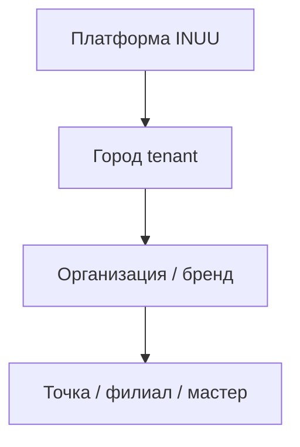

# Мультитенантная архитектура (несколько городов)

## Принцип

**Мульти-город в данных и URL с первого дня**, без обязательного UI «выберите город» пока активен один город.

Пользователь заходит на домен → незаметный редирект на slug единственного города → живёт как на обычном городском сайте.

---

## Уровни tenancy



| Уровень | Пример | Изоляция |
|---------|--------|----------|
| **Platform** | Админ INUU, биллинг рекламы, глобальные настройки | Общий |
| **City** | `ulan-ude`, `irkutsk` | Контент, SEO, валюта, часовой пояс, редакция |
| **Organization** | Сеть салонов, организатор событий, кондитер | ЛК партнёра, реквизиты, бренд |
| **Branch / Provider** | Салон на ул. X, мастер в двух салонах, турбаза | Расписание, заказы, отзывы точки |

Каждая бизнес-запись (событие, мастер, заведение, товар витрины) **обязательно** имеет `city_id`.

---

## База данных (минимум)

### Таблица `cities`

| Поле | Описание |
|------|----------|
| `id` | UUID или bigint |
| `name` | «Улан-Удэ» |
| `slug` | `ulan-ude` (уникальный) |
| `timezone` | `Asia/Irkutsk` |
| `is_active` | Показывать в переключателе городов |
| `default_locale` | `ru` |

**Seed на старте:** одна строка Улан-Удэ.

### `city_id` во всех доменных таблицах

- `venues` (заведения)
- `events`
- `providers` / `masters` (исполнители)
- `bookings` / `orders`
- `reviews`
- `stories`
- `hot_slots`
- `ad_campaigns`
- `user_favorites`
- `news_posts`

**Правило API:** любой публичный запрос фильтруется по `city_id` (из URL slug) или отклоняется.

### Пользователи

- `users` — глобальные (один аккаунт на платформу).
- `user_city_preferences` — избранные категории, подписки на рассылки **в разрезе города**.
- При добавлении второго города — опциональный city picker в шапке.

---

## URL и маршрутизация

### Публичная витрина

```
https://inuu.ru/                          → redirect → /ulan-ude
https://inuu.ru/ulan-ude                   → главная города
https://inuu.ru/ulan-ude/events            → афиша
https://inuu.ru/ulan-ude/events/:slug      → событие
https://inuu.ru/ulan-ude/venues/:slug      → заведение
https://inuu.ru/ulan-ude/beauty            → красота
https://inuu.ru/ulan-ude/beauty/:slug      → мастер / салон
https://inuu.ru/ulan-ude/map               → карта
```

### Служебные (без префикса города)

```
/login
/dashboard          → ЛК партнёра (контекст города из membership)
/admin              → редакция / платформа
/advertiser         → рекламодатель
```

### Конфиг

```env
DEFAULT_CITY_SLUG=ulan-ude
```

Middleware: `path === '/'` → `navigateTo('/' + defaultCitySlug)`.

Маршруты Nuxt: `pages/[city_slug]/...` (см. [MULTI_TENANT_SAAS.md](../platform/MULTI_TENANT_SAAS.md), [11-tech-stack.md](./11-tech-stack.md)).

---

## Контекст в runtime

Каждый HTTP-запрос к витрине резолвит:

```ts
interface CityContext {
  cityId: string
  citySlug: string
  timezone: string
}
```

Партнёрский дашборд:

```ts
interface PartnerContext extends CityContext {
  organizationId: string
  branchIds: string[]   // RBAC
  role: 'owner' | 'manager' | 'staff'
}
```

Уведомления (Telegram / email) **всегда** включают: город, бренд, точку, номер заказа/записи (см. OMNICHANNEL_MULTITENANT_PLAN_RU.md).

---

## Редакция и контент по городам

- На старте контент новостей/афиши ведёт **редакция одного города** (Юмжина).
- При втором городе: `editorial_team_city` или роль `city_editor` с scope только на свой `city_id`.
- Подборки и stories могут быть `city_id` + `is_featured`.

---

## Масштабирование на новый город

Чеклист (после стабилизации в Улан-Удэ):

1. INSERT в `cities` (name, slug, timezone).
2. Назначить редактора / партнёра по контенту.
3. Импорт или ручное наполнение: 30+ venues, 20+ events, beauty seed.
4. Включить `is_active`, опционально — баннер «Мы в Иркутске» на главной первого города.
5. SEO: отдельные sitemap и мета-шаблоны с `{cityName}`.
6. Реклама и рекламодатели — кампании с `city_id` (не показывать баннер Улан-Удэ в Чите).

**Не масштабировать**, пока не найдена устойчивая ниша и монетизация в первом городе.

---

## Фестивали и временные зоны

Спец-кейс: фестиваль = **временный tenant-подтип** города:

- `cities.slug = festival-2026-uu` или флаг `is_event_zone` + даты `active_from` / `active_to`.
- Все киоски фестиваля — `venues` с общим `city_id` фестиваля.
- После окончания — архив, редирект на основной город.

---

## Безопасность и RLS (Supabase)

Если backend на Supabase:

- RLS: `city_id` = `current_setting('app.city_id')` для публичного read.
- Партнёр: политика по `organization_id` / `branch_id` из JWT или session.
- Платформенный админ — bypass только в service role.

---

## Связь с монорепозиторием incity

Мульти-город строится на `cities` + `city_id` во всех доменных таблицах INUU (beauty, events, tourism, редакция) — одна платформа, без отдельного репозитория.
