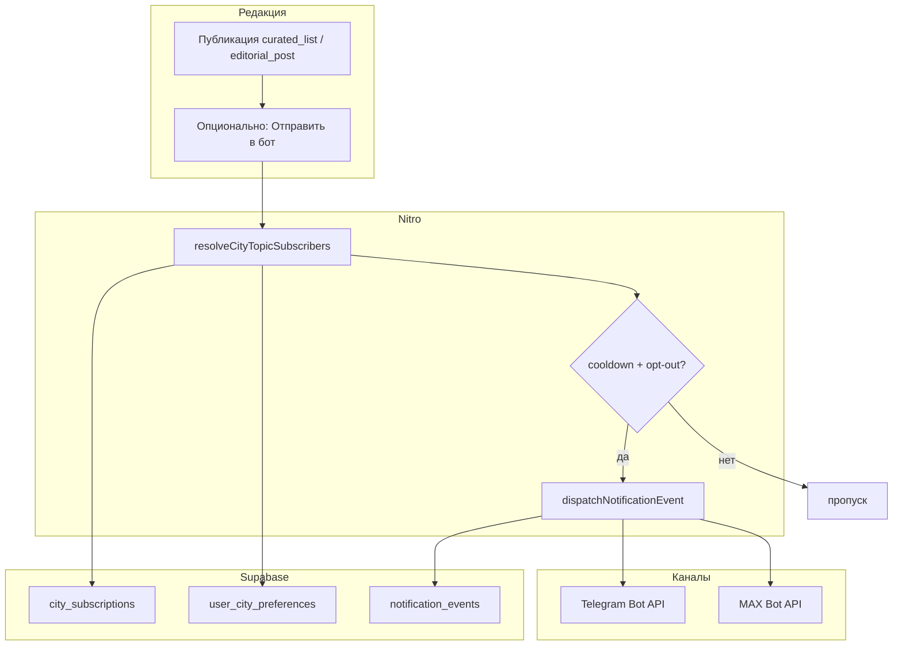

# Рассылка подборок и подписки на темы (Telegram / MAX)

**Статус:** спецификация (код частично запланирован в `implementation/02-refactor-existing.md`).  
**Бот:** один `@inuu_bot` — контент, auth, уведомления ([04-telegram-bot-content-moderation.md](./04-telegram-bot-content-moderation.md)).

---

## Цели

| Задача | Описание |
|--------|----------|
| **Рассылка подборок** | Редакция публикует `curated_lists` → подписчики получают сообщение в TG/MAX с превью и ссылкой на сайт / Mini App |
| **Подписка по темам** | Пользователь сам выбирает, о чём получать пуши: афиша, красота, туры, «новости города», конкретная подборка |
| **Не спамить** | Маркетинговые рассылки с лимитами; транзакционные (билет, запись) — без лимита |

Идеи по лимитам и «сэндвичу» дайджеста — в [brainstorm: рассылки и теги](../../../content/brainstorm/aggregator/01-rassylki-bonusy-dajdzhesty-tegi-produkt.md). Поведенческие теги для персонализации — [AGGREGATOR_EVENTS_TAGS_ANALYTICS_RU.md](../../../platform/AGGREGATOR_EVENTS_TAGS_ANALYTICS_RU.md).

---

## Два слоя персонализации

Не смешивать **явные подписки** и **неявные теги**:

| Слой | Кто задаёт | Где хранится | Для чего |
|------|------------|--------------|----------|
| **Подписки (opt-in)** | Пользователь в боте / на сайте | `city_subscriptions`, `user_city_preferences.interest_tags` | «Хочу пуши про события и выходные» |
| **Поведенческие теги** | Система по действиям | `profiles.metadata` / JSONB (позже) | Персональный блок внутри дайджеста, реклама ресторанов — **фаза 2+** |

На MVP достаточно **явных подписок + тегов контента** на постах и подборках.

---

## Типы рассылок

| Тип | Сущность | Ключ уведомления | Кому |
|-----|----------|------------------|------|
| **Подборка редакции** | `curated_lists` | `CURATED_LIST_PUBLISHED` (новый) | Подписчики `topic_slug` подборки + общий `digest` |
| **Новость / обзор** | `editorial_posts` | `EDITORIAL_POST_PUBLISHED` (новый) | Подписчики тегов поста + `news` |
| **Дайджест афиши** | агрегат `events` за неделю или `post_type = afisha_digest` | `EVENT_DIGEST` (уже в [07-notifications-channels.md](../../07-notifications-channels.md)) | `events`, `digest` |
| **Горящее / waitlist** | `hot_slots`, waitlist | `HOT_SLOT_PUBLISHED`, `WAITLIST_SLOT_AVAILABLE` | Узкая подписка или контекст записи |

Транзакционные (`EVENT_TICKET`, `BOOKING_*`) — отдельно, не через эту спеку.

---

## Таксономия тем (`topic_slug`)

Значения в `city_subscriptions.topic_slug` (уже есть таблица, см. `010_inuu_user_engagement.sql`):

### Системные (город)

| `topic_slug` | Русское название в боте | Что приходит |
|--------------|-------------------------|--------------|
| `digest` | «Главное по городу» | 1–2 раза в неделю: сводка (подборка недели + 2–3 новости) |
| `events` | «Афиша и мероприятия» | Новые `events`, напоминания по избранному |
| `news` | «Новости и обзоры» | `editorial_posts` с `post_type` news / review / guide |
| `beauty` | «Красота и запись» | Слоты, hot_slots, beauty-вертикаль |
| `tours` | «Туры и Байкал» | Туризм, лиды |
| `masterclass` | «Мастер-классы» | `events` + category masterclass |

### Контентные (привязка к slug)

| `topic_slug` | Пример | Когда создавать |
|--------------|--------|-----------------|
| `list:{slug}` | `list:weekend` | При публикации именованной подборки — опциональная «узкая» подписка |
| `event:{uuid}` | `event:550e8400-…` | Напоминание за 24 ч до конкретного события |

Правило: **одна строка в `city_subscriptions` = один topic + один канал** (`telegram` | `max`). Уникальность: `(user_id, city_id, channel, topic_slug)`.

---

## Теги контента (для фильтрации новостей)

На постах и подборках — **массив тегов тематики**, не путать с `vibe_tags` у venue.

### Миграция (фаза 1 рассылок)

```sql
-- Справочник опционален; на старте — фиксированный enum в коде + text[]
alter table public.editorial_posts
  add column if not exists topic_tags text[] not null default '{}';

alter table public.curated_lists
  add column if not exists topic_tags text[] not null default '{}';

create index if not exists idx_editorial_posts_topic_tags
  on public.editorial_posts using gin (topic_tags);

create index if not exists idx_curated_lists_topic_tags
  on public.curated_lists using gin (topic_tags);
```

### Рекомендуемый словарь `topic_tags` (Улан-Удэ MVP)

| Тег | Примеры контента |
|-----|------------------|
| `food` | Открытия, гастро, кофе |
| `culture` | Театр, выставки, концерты |
| `family` | С детьми, парки |
| `nightlife` | Бары, вечеринки |
| `sport` | Марафоны, секции |
| `beauty` | Салоны, МК красоты |
| `tourism` | Байкал, экскурсии |
| `city` | Городские новости, инфраструктура |

Связь с `topic_slug` подписки:

- Пользователь подписан на `news` → получает все опубликованные посты **или** пересечение: `interest_tags` ∩ `post.topic_tags` не пусто.
- Пользователь выбрал в `/start` только `food` + `culture` → в `user_city_preferences.interest_tags` → фильтр на push.

---

## Профиль интересов пользователя

| Поле | Таблица | Назначение |
|------|---------|------------|
| `interest_tags` | `user_city_preferences` | Явный выбор в боте (чипы при `/start`) |
| `notify_channels` | `user_city_preferences` | `{ "telegram": true, "max": false }` |
| `metadata.notify` | `profiles` или `city_subscriptions.metadata` | cooldown, `marketing_opt_out` |

При `/start`:

1. Привязка `telegram_id` / `max_user_id` → `profiles`.
2. Выбор города (если не задан `default_city_id`).
3. Inline-клавиатура: «Что присылать?» — мультивыбор тегов + пресеты (`Всё главное` = `digest`, `Только афиша` = `events`).
4. Запись в `user_city_preferences` + строки в `city_subscriptions` для каждого выбранного `topic_slug`.

Команды:

| Команда | Действие |
|---------|----------|
| `/subscribe` | Меню тем; toggle topic |
| `/unsubscribe` | Снять topic или «только заказы» (`marketing_opt_out`) |
| `/my` | Билеты, записи, активные подписки (без изменения логики заказов) |

---

## MVP-набор (Улан-Удэ, фаза R0–R1)

Упрощённый контур, чтобы быстрее запустить рассылку подборок и не перегрузить `/start`. Полный словарь тем и тегов — в разделах выше; ниже — **что реально показываем пользователю на первом релизе**.

### Что включаем в MVP

| Уровень | MVP | После MVP (R2+) |
|---------|-----|-----------------|
| **Темы (`topic_slug`)** | `digest`, `events`, `news` | `beauty`, `tours`, `masterclass`, `list:{slug}`, `event:{uuid}` |
| **Теги интересов** | `food`, `culture`, `family`, `nightlife`, `tourism` | + `sport`, `beauty`, `city` |
| **Пресеты `/start`** | 2 штуки + «Настроить вручную» | — |
| **Подписка на одну подборку** | нет (только через `digest`) | `list:weekend` и др. |
| **Фильтр новостей по тегам** | да, если выбраны `interest_tags` | то же |
| **Каналы** | только Telegram | + MAX (`channel = max`) |
| **Настройки на сайте** | нет | профиль в Mini App |

### Темы в боте (3 кнопки)

| Кнопка в UI | `topic_slug` | По умолчанию при `/start` |
|-------------|--------------|---------------------------|
| 📬 Главное по городу | `digest` | **вкл** |
| 🎭 Афиша | `events` | выкл |
| 📰 Новости и обзоры | `news` | выкл |

Пользователь может включить любую комбинацию. Без ни одной темы (и без opt-out) — считаем, что выбран только `digest` (см. дефолт ниже).

### Теги интересов (5 чипов, опционально)

Показываются **вторым шагом** после выбора пресета или по кнопке «Уточнить темы» — можно пропустить («Пока не важно»).

| Чип | `interest_tags` | Зачем на старте |
|-----|-----------------|-----------------|
| 🍽 Еда и места | `food` | Открытия, гастро |
| 🎭 Культура | `culture` | Концерты, выставки |
| 👨‍👩‍👧 С семьёй | `family` | Выходные, дети |
| 🌙 Вечер / бары | `nightlife` | Вечерняя афиша |
| 🏔 Туры и Байкал | `tourism` | Байкал, экскурсии |

**Правило MVP:** если `interest_tags` пустой — пользователь получает всё по включённым **темам** без уточнения по жанру. Если теги выбраны — для `news` и подборок с `topic_tags` действует пересечение (как в ADR §2).

### Пресеты при `/start` (2 + ручной)

| Пресет | Включает | Типичный пользователь |
|--------|----------|------------------------|
| **«Главное раз в неделю»** | `digest` | Не хочет частых пушей |
| **«Афиша + главное»** | `digest` + `events` | Ходит на мероприятия |
| **«Настроить самому»** | переход к экрану тем + тегов | — |

Отдельный пресет «Только новости» (`news` без `digest`) — **не в MVP** (добавить в R2, если попросит редакция).

### Дефолты, если пользователь ничего не нажал

| Ситуация | Поведение |
|----------|-----------|
| Первый `/start`, ушёл без выбора | `digest` + `channel=telegram`, `interest_tags=[]` |
| Уже был в боте (заказы) | не менять существующие `city_subscriptions` |
| `marketing_opt_out` | только транзакционные пуши |

### Экран `/subscribe` (MVP)

Один экран, без вложенных меню:

```text
Уведомления • Улан-Удэ

[✓] Главное по городу
[ ] Афиша
[ ] Новости

Уточнить: Еда · Культура · Семья · Вечер · Туры
(нажатие — toggle, ✓ у активных)

[🔕 Только записи и билеты]
```

Callback-префиксы те же: `inuu:sub:toggle:digest`, `inuu:sub:toggle:tag:food`, `inuu:sub:optout:marketing`.

### Что ставит редакция (MVP)

На постах и подборках использовать **только MVP-теги** из таблицы выше (+ при необходимости дублировать смысл в `topic_tags` поста: `food`, `culture`, …). Не публиковать контент с тегами `sport` / `city` до R2 — иначе фильтр не сработает для пользователей.

### Сводка: MVP vs полная модель

```text
Полная модель:  6+ topic_slug × 8 interest_tags × list:* × event:*
MVP:            3 topic_slug × 5 interest_tags × 2 пресета × opt-out
```

---

## Рассылка подборки: продуктовый сценарий

### 1. Редакция публикует

1. Dashboard «Контент города» → подборка `weekend` → `is_published = true`, `topic_tags = '{family,culture}'`.
2. Кнопка **«Отправить в бот»** (или автоматически при publish — настройка города).

### 2. Сервер формирует аудиторию

```text
получатели =
  city_subscriptions
  WHERE city_id = :city
    AND channel IN ('telegram', 'max')
    AND (
      topic_slug = 'digest'
      OR topic_slug = 'list:weekend'
      OR topic_slug = 'events'  -- если подборка только из events
    )
  AND user проходит фильтр interest_tags (если заданы)
  AND NOT marketing_opt_out
  AND cooldown OK
```

### 3. Сообщение в мессенджер

Шаблон (Telegram):

```text
📍 Улан-Удэ • INUU

🗓 {curated_list.title}
{curated_list.description — 1–2 строки}

1. {item.note или venue.title}
2. …
(до 5 пунктов в тексте; полный список — на сайте)

[Открыть подборку]  [Настроить подписки]
```

- **Открыть подборку** — `url` → `/{city_slug}/lists/{listSlug}` или WebApp.
- **Настроить подписки** — `callback_data: inuu:sub:menu`.

Для альбома из TG-импорта (`source_telegram_message_id`) — опционально `sendMediaGroup` + одно сообщение с кнопкой (см. `scripts/import_telegram_afisha.py`).

### 4. Лог и идемпотентность

- `dispatchNotificationEvent` с `eventType: 'CURATED_LIST_PUBLISHED'`, `entity_id: list.id`.
- Idempotency: не слать повторно ту же подборку тому же user без флага `force_resend` в dashboard.
- Таблица `notification_events` — как для заказов ([07-notifications-channels.md](../../07-notifications-channels.md)).

---

## Рассылка новости по тегам

При `editorial_posts.is_published`:

1. Прочитать `topic_tags` (если пусто — считать тег `city` или слать только подписчикам `news` без фильтра).
2. Аудитория: `city_subscriptions` где `topic_slug = 'news'` **и** (`interest_tags` пусто **или** пересечение с `topic_tags`).
3. Текст: заголовок, `excerpt`, обложка, кнопка «Читать» → `/guides/{slug}`.

Отдельно: `post_type = afisha_digest` — широкая рассылка на `events` + `digest`, не дублировать N отдельных event-push.

---

## Лимиты и антиспам

| Правило | Значение MVP | Где хранить |
|---------|--------------|-------------|
| Маркетинговых пушей на пользователя | ≤ **2 / 7 дней** (редакция + партнёры суммарно) | `profiles.metadata.last_marketing_sent_at` + счётчик |
| Дайджест города | ≤ **2 / неделю** | cron + проверка перед batch |
| Повтор той же подборки | запрещён | idempotency key |
| Opt-out | «Только уведомления о записях и билетах» | `metadata.marketing_opt_out = true` |
| Quiet hours | 22:00–09:00 локаль `cities.timezone` | не слать marketing (кроме срочного hot_slot) |

Транзакционные уведомления лимиту **не** подчиняются.

---

## Техническая реализация

### Уже в репозитории

| Компонент | Путь |
|-----------|------|
| Подписки БД | `supabase/migrations/010_inuu_user_engagement.sql` |
| Подборки API | `server/api/cities/[slug]/lists/[listSlug].get.ts` |
| Dispatch | `server/utils/notifications.ts` |
| Webhook TG | `server/api/webhook.post.ts` |
| Импорт афиши из TG | `scripts/import_telegram_afisha.py` |

### Добавить (по фазам)

| Задача | Файл / действие |
|--------|-----------------|
| Типы событий | `NotificationEvent`: `CURATED_LIST_PUBLISHED`, `EDITORIAL_POST_PUBLISHED` |
| Резолвер получателей | `resolveCityTopicSubscribers(cityId, topicSlugs[], interestFilter?)` |
| Cooldown | `server/utils/notificationCooldown.ts` |
| Роутинг бота | `server/utils/inuuSubscriptionBot.ts` — `inuu:sub:*` callbacks |
| Cron дайджеста | `server/api/cron/city-digest.post.ts` + `CRON_SECRET` |
| Dashboard | кнопка «Отправить подписчикам» → `POST /api/dashboard/editorial/lists/[id]/broadcast` |

### Псевдокод batch-рассылки

```typescript
// server/utils/editorialBroadcast.ts
export async function broadcastCuratedList(event: H3Event, listId: string) {
  const list = await loadList(listId)
  const recipients = await resolveCityTopicSubscribers(event, {
    cityId: list.city_id,
    topicSlugs: ['digest', `list:${list.slug}`, ...tagsToTopics(list.topic_tags)],
    interestTags: null, // или фильтр per-user при итерации
  })
  for (const r of recipients) {
    if (!await canSendMarketing(r.userId)) continue
    await dispatchNotificationEvent(event, {
      eventType: 'CURATED_LIST_PUBLISHED',
      entityId: list.id,
      actorContext: { customerTelegramId: r.telegramId, ... },
      payload: { listSlug: list.slug, title: list.title, previewItems: [...] },
    })
  }
}
```

---

## Схема потока (mermaid)



---

## UX: экран подписок в боте

**MVP** — см. раздел [MVP-набор](#mvp-набор-улан-удэ-фаза-r0r1). Ниже — **полный** экран (R2+).

**Текст:** «Выберите темы для Улан-Удэ. Можно изменить в любой момент.»

| Кнопка | callback | Эффект |
|--------|----------|--------|
| 🎭 Афиша | `inuu:sub:toggle:events` | ± `city_subscriptions` |
| 📰 Новости | `inuu:sub:toggle:news` | ± |
| 💅 Красота | `inuu:sub:toggle:beauty` | ± (R2+) |
| 🏔 Туры | `inuu:sub:toggle:tours` | ± (R2+) |
| 🎓 Мастер-классы | `inuu:sub:toggle:masterclass` | ± (R2+) |
| 🍽 Еда и места | `inuu:sub:toggle:tag:food` | ± в `interest_tags` |
| … | `inuu:sub:toggle:tag:*` | … |
| 📬 Всё главное (дайджест) | `inuu:sub:toggle:digest` | ± |
| 🔕 Только записи и билеты | `inuu:sub:optout:marketing` | `marketing_opt_out` |

После toggle — короткое подтверждение: «Включено: Афиша, Еда. Отключено: Туры.»

---

## Фазы внедрения

| Фаза | Срок | Содержание |
|------|------|------------|
| **R0** | 3–5 дн | Миграция `topic_tags`; ручная рассылка через dashboard test → один topic `digest` |
| **R1** | 1 нед | **MVP-набор:** `/subscribe`, `/start` (3 темы + 5 тегов); `CURATED_LIST_PUBLISHED`; cooldown |
| **R2** | 1 нед | Расширение тем (`beauty`, `tours`, `masterclass`); фильтр новостей; cron дайджеста; `list:{slug}` |
| **R3** | позже | Персональный блок дайджеста по поведенческим тегам; платные слоты в рассылке ([06-monetization.md](../../06-monetization.md)) |

Задачи R1–R2 дублируют пункты в [implementation/02-refactor-existing.md](../../implementation/02-refactor-existing.md) (webhooks subscribe, `EVENT_DIGEST`).

---

## ADR (черновик)

| # | Вопрос | Решение |
|---|--------|---------|
| 1 | Подписка на каждую подборку отдельно? | **Не в MVP.** R2+: `list:{slug}`; в MVP — только `digest` + теги |
| 6 | Сколько тем/тегов в MVP? | **3 темы + 5 тегов**, 2 пресета — см. [MVP-набор](#mvp-набор-улан-удэ-фаза-r0r1) |
| 2 | Фильтр новостей | **Пересечение** `interest_tags` пользователя и `topic_tags` поста; пустые теги поста → всем подписчикам `news` |
| 3 | Автоотправка при publish? | **Настройка города** `auto_broadcast_on_publish` (default: false для MVP) |
| 4 | MAX и Telegram | Одинаковая логика; разные `channel` в `city_subscriptions` |
| 5 | Публичный TG-канал vs бот | Канал — охват; бот — **персональные** подписки и deep link. Не дублировать 1:1 без нужды |

---

## Открытые вопросы

1. Нужен ли пользователю **email-дубль** дайджеста на MVP? (см. [07-notifications-channels.md](../../07-notifications-channels.md) — приоритет TG/MAX)
2. Подборка только из `events` — слать подписчикам `events` или отдельный тег `afisha`?
3. Партнёрский платный push в подборке — очередь модерации до broadcast ([07-paid-news-publication.md](./07-paid-news-publication.md)).

---

## Связанные документы

| Документ | Тема |
|----------|------|
| [07-notifications-channels.md](../../07-notifications-channels.md) | Каналы, `EVENT_DIGEST`, `city_subscriptions` |
| [verticals/news-and-editorial.md](../../verticals/news-and-editorial.md) | Типы материалов |
| [03-recommended-mvp.md](./03-recommended-mvp.md) | Фазы контента |
| [09-data-model-overview.md](../../09-data-model-overview.md) | ER-модель |
| [implementation/02-refactor-existing.md](../../implementation/02-refactor-existing.md) | Задачи в коде |
