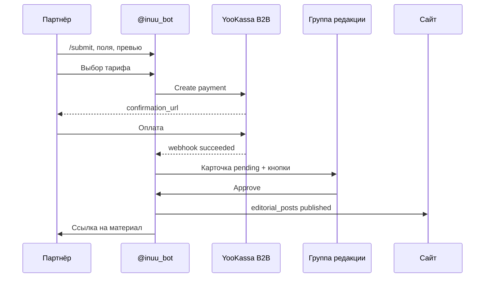

# Оплата за публикацию новостей и партнёрского контента

Варианты прикрепления платежа к размещению **партнёрских** новостей и анонсов. Материалы редакции (`/news` от Юмжины) — **бесплатно**.

**Связано:** [04-telegram-bot-content-moderation.md](./04-telegram-bot-content-moderation.md), [05-bot-news-dialog-script.md](./05-bot-news-dialog-script.md), [06-monetization.md](../../06-monetization.md), [verticals/advertising.md](../../verticals/advertising.md), [payments/PAYMENTS_RU_YOOKASSA_TBANK.md](../../../payments/PAYMENTS_RU_YOOKASSA_TBANK.md), [platform/SAAS_BILLING_RU.md](../../../platform/SAAS_BILLING_RU.md).

---

## Зачем брать деньги

| Цель | Комментарий |
|------|-------------|
| Отсечь спам | Платная заявка воспринимается серьёзнее |
| Монетизация | В продукте: «нативное упоминание» у типа «Новость» |
| Справедливость | Бесплатный PR только для редакции, не для всех B2B |
| Юридическая ясность | Платный PR ≠ редакционный материал → маркировка на сайте |

**Разделение:**

| Тип | Кто создаёт | Оплата |
|-----|-------------|--------|
| Редакционная новость / обзор | `/news`, редакция | Нет |
| Партнёрский анонс / PR | `/submit` → новость | Да (или счёт / бартер) |
| Событие / МК в афише | `/submit` → event | Отдельный прайс (см. [02-masterclasses-events-options.md](./02-masterclasses-events-options.md)) |

---

## Продукты (SKU)

Ориентиры для Улан-Удэ — уточнить после первых 10 продаж ([06-monetization.md](../../06-monetization.md)).

| `product_code` | Название | Что входит | Ориентир цены |
|----------------|----------|------------|---------------|
| `news_basic` | Базовый | Страница `/guides/{slug}` + лента города | 2 000 – 5 000 ₽ |
| `news_plus` | Стандарт | Базовый + пост в Telegram-канале города | 5 000 – 12 000 ₽ |
| `news_bundle_weekend` | Выходные | Стандарт + слот в подборке `curated_lists` | 8 000 – 20 000 ₽ |
| `news_story_addon` | Story 24ч | Доп. к любому пакету: `story_campaigns` | +3 000 – 7 000 ₽ |
| `event_listing_basic` | Афиша | Карточка в `events` без продвижения | 0 – 3 000 ₽ |
| `event_listing_promoted` | Афиша + промо | `is_promoted` + приоритет в ленте | договорная |

Пакеты «сайт + TG + подборка» пересекаются с [verticals/advertising.md](../../verticals/advertising.md) (`telegram_digest`, `native_list`) — в биллинге лучше один **пакетный** SKU, а не три отдельных платежа.

---

## Варианты: когда списывать деньги

### Вариант 1 — Оплата до модерации (рекомендуем для MVP)



| Плюсы | Минусы |
|-------|--------|
| Очередь модерации только из оплаченных заявок | Нужна политика возвратов при отклонении |
| Выше конверсия «оплатил → ждёт» | Партнёр платит до проверки качества |
| Проще автоматизация в боте | |

**Рекомендация:** основной поток для `/submit` → news.

---

### Вариант 2 — Оплата после одобрения

```
/submit → pending → редактор ✅ → «Оплатите 3 000 ₽» → publish
```

| Плюсы | Минусы |
|-------|--------|
| Платят только за принятое | Много «одобрено, не оплатили» |
| Меньше возвратов | Редакция тратит время до оплаты |

**Когда:** пилот с доверенными партнёрами или крупные клиенты «сначала согласуем текст».

---

### Вариант 3 — Депозит + основная оплата

- При отправке: малый депозит (300–500 ₽), удерживается при явном спаме.
- После approve: основная сумма.

| Плюсы | Минусы |
|-------|--------|
| Снижает мусорные заявки | Сложный UX, два платежа |

**Не MVP.**

---

### Вариант 4 — Счёт / договор (B2B)

- Менеджер выставляет счёт юрлицу.
- В БД: `payment_status = invoiced`, `invoice_ref`, срок оплаты.
- Модерация: сразу или после поступления на р/с (политика).

| Плюсы | Минусы |
|-------|--------|
| Привычно для сетей и ТЦ | Ручной учёт, задержка |
| Нет комиссии эквайринга в диалоге | |

**Рекомендация:** параллельно с вариантом 1 с первого дня — кнопка «Счёт для юрлица» в боте → уведомление менеджеру.

---

### Вариант 5 — Бартер / промо

- Обмен: пост в IG редакции ↔ размещение на INUU.
- В системе: `payment_status = barter`, `barter_note`, без `payment_id`.
- Модерация как у `paid` — чтобы не терять аудит.

**Не автоматизировать на MVP** — флаг в dashboard.

---

## Сводная таблица

| Вариант | MVP | Автоматизация | Возвраты | Для кого |
|---------|-----|---------------|----------|----------|
| 1. До модерации | **да** | ★★★★ | Нужны | Массовый `/submit` |
| 2. После approve | нет | ★★★ | Редко | VIP / пилот |
| 3. Депозит | нет | ★★ | Средне | — |
| 4. Счёт B2B | **да** | ★★ | По договору | Юрлица |
| 5. Бартер | опционально | ★ | — | Партнёры SMM |

**Итог MVP:** **1 + 4**; редакция всегда **waived_editorial**.

---

## Платёжный контур (техника)

По [PAYMENTS_RU_YOOKASSA_TBANK.md](../../../payments/PAYMENTS_RU_YOOKASSA_TBANK.md):

| Контур | Назначение | Куда идут деньги |
|--------|------------|------------------|
| **B2B платформы** | Публикация новости, реклама, SaaS | Р/с **INUU** |
| B2C shop | Билеты на события, запись beauty | Р/с **организатора** |

Для новостей партнёра — только **B2B платформы** (ключи YooKassa/T-Bank INUU, не `shop` партнёра).

Минимальный flow:

1. `POST /api/content/payments/create` — `submission_id`, `product_code`, `amount`.
2. Провайдер → `confirmation_url` в бот.
3. `POST /api/payments/webhook` — `payment_kind: content_publication`.
4. Обновить `content_submissions.payment_status = paid` → отправить карточку в группу модерации.

Идемпотентность: уникальность `(payment_kind, submission_id)`.

---

## Модель данных

### Расширение `content_submissions`

```sql
alter table public.content_submissions
  add column if not exists product_code text,
  add column if not exists amount integer not null default 0,
  add column if not exists currency text not null default 'RUB',
  add column if not exists payment_status text not null default 'unpaid'
    check (payment_status in (
      'unpaid',
      'pending_payment',
      'paid',
      'invoiced',
      'waived_editorial',
      'barter',
      'refunded',
      'failed'
    )),
  add column if not exists payment_id uuid,
  add column if not exists invoice_ref text,
  add column if not exists paid_at timestamptz;
```

### Каталог тарифов

```sql
create table if not exists public.content_products (
  code text primary key,
  city_id uuid references public.cities(id) on delete cascade,
  kind text not null check (kind in ('news', 'event')),
  name text not null,
  description text,
  price integer not null check (price >= 0),
  currency text not null default 'RUB',
  includes jsonb not null default '{}',
  is_active boolean not null default true,
  sort_order integer not null default 0,
  created_at timestamptz not null default now()
);
```

Пример `includes`:

```json
{
  "site_guide": true,
  "telegram_channel_post": true,
  "curated_list_slug": "weekend",
  "story_placement": null
}
```

### Платежи

Связь с общей таблицей `payments` / `billing_payments` (по мере унификации):

| Поле | Значение |
|------|----------|
| `payment_kind` | `content_publication` |
| `metadata` | `{ submission_id, product_code, city_id, shop_id? }` |
| `user_id` / `shop_id` | плательщик-партнёр |

### После публикации

```sql
alter table public.editorial_posts
  add column if not exists is_sponsored boolean not null default false,
  add column if not exists content_submission_id uuid references public.content_submissions(id);
```

---

## Правила модерации с оплатой

| `payment_status` | Карточка в группе | Approve |
|------------------|-------------------|---------|
| `unpaid`, `pending_payment` | не отправлять / «ожидает оплаты» | нет |
| `paid`, `invoiced`, `barter`, `waived_editorial` | полная карточка + ✅/❌ | да |

Строка в карточке для редакторов:

```
💳 Оплачено: 7 000 ₽ · news_plus · 26.05.2026 14:32
📄 Счёт №СЧ-1042 · invoiced · срок 10.06
✏️ Редакция · без оплаты
🤝 Бартер · пост в IG @inuu_ulanude
```

---

## UX в боте

Вставка **после превью**, **до** отправки в группу ([05-bot-news-dialog-script.md](./05-bot-news-dialog-script.md)).

**Бот:**

```
Размещение новости для партнёров — платное.
Редакционные обзоры готовит команда INUU отдельно.

Выберите формат:
```

| Кнопка | callback |
|--------|----------|
| Базовый — 3 000 ₽ | `inuu:pay:product:news_basic` |
| Стандарт — 7 000 ₽ | `inuu:pay:product:news_plus` |
| Пакет «Выходные» — 12 000 ₽ | `inuu:pay:product:news_bundle_weekend` |
| Счёт для юрлица | `inuu:pay:invoice` |

**После выбора онлайн-оплаты:**

```
Оплата картой (ЮKassa), безопасное соединение.

[ 💳 Оплатить 7 000 ₽ ]

Ссылка действует 15 минут.
После оплаты заявка автоматически поступит на модерацию (1–2 рабочих дня).
```

**`/my_submissions`:**

```
🟠 #a1b2 · Новость · ожидает оплаты
🟡 #c3d4 · Новость · на проверке (оплачено 7 000 ₽)
✅ #e5f6 · опубликовано → ссылка
❌ #g7h8 · отклонено · возврат на карту 3–10 дней
```

---

## Политика возвратов

| `reject_reason_code` | Возврат | Комментарий |
|----------------------|---------|-------------|
| `spam` | 0% | В оферте |
| `off_topic` | 0% | |
| `incomplete_data` | 100% или бесплатная правка | `needs_revision` без нового платежа |
| `duplicate` | 100% | |
| `other` | по решению редактора | комментарий обязателен |

**MVP:** кнопка в dashboard «Инициировать возврат» → ручной refund в YooKassa + `payment_status = refunded`.

**Правка без доплаты:** при `needs_revision` сохранять `payment_status = paid`, тот же `submission_id` — повторная модерация без второго платежа.

---

## Маркировка на сайте и в каналах

| Канал | Требование |
|-------|------------|
| Сайт | Бейдж «Партнёрский материал» или «Реклама» при `is_sponsored` |
| Telegram-канал | `#реклама` или «При поддержке {бренд}» |
| Подборки | Платный слот не выдавать за редакционный без пометки |

Редакционные посты: `is_sponsored = false`, автор `inuu-editorial`.

---

## Связь с `feature_catalog` и рекламой

| Механизм | Таблица | Когда |
|----------|---------|-------|
| Разовая публикация новости | `content_products` + `content_submissions` | `/submit` news |
| Модуль «Реклама» | `inuu_ads` + `ad_campaigns` | Баннеры, story-слоты |
| Подписка shop | `shop_feature_subscriptions` | Долгосрочный доступ |

Возможная скидка: при активном `inuu_city_listing` — промокод или −X% на `news_basic` (фаза 2).

---

## События и МК

Та же схема `payment_status` на `content_submissions` с `kind = event`:

- Freemium: N бесплатных публикаций / месяц на `shop_id`.
- Платное продвижение: `event_listing_promoted`.
- Комиссия с билета — отдельный поток B2C, не смешивать с платой за **размещение** в афише.

---

## Этапы внедрения

| Этап | Содержание | Срок ориентир |
|------|------------|---------------|
| **0** | Прайс в Notion; счёт вручную; `invoiced` в БД; модерация в TG | до бота |
| **1** | `content_products` + оплата в боте (вариант 1) + YooKassa B2B | +1 нед к R11 |
| **2** | Автовозврат, промокоды, `is_sponsored` на сайте | |
| **3** | Dashboard: история платежей, повтор публикации, отчёты | |

Задачи в коде: **R11** в [implementation/02-refactor-existing.md](../../implementation/02-refactor-existing.md).

---

## Открытые вопросы

1. Фиксированный прайс в боте или «от 3 000 ₽, менеджер уточнит» для первых клиентов?
2. НДС и чек для юрлиц при онлайн-оплате на платформу.
3. Одна оферта на контент + рекламу или отдельные документы.
4. Лимит бесплатных `event_listing` для shop с `inuu_city_listing`.
5. % возврата при отклонении по вине партнёра vs редакции — утвердить с юристом.

---

## Связанные документы

- [03-recommended-mvp.md](./03-recommended-mvp.md) — фазы продукта
- [04-telegram-bot-content-moderation.md](./04-telegram-bot-content-moderation.md) — модерация
- [05-bot-news-dialog-script.md](./05-bot-news-dialog-script.md) — шаг оплаты в диалоге
- [01-news-editorial-options.md](./01-news-editorial-options.md) — способы добавления контента

**Статус:** согласованная концепция MVP (варианты 1 + 4); цены и возвраты — на утверждение редакцией.
