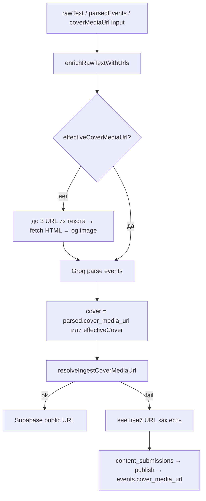
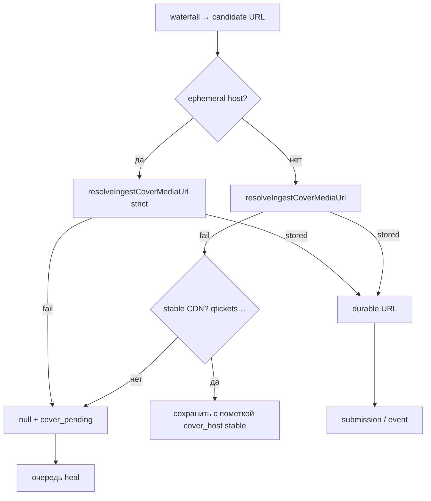

# Стабильные афиши: пайплайн cover media

**Контекст:** кейс [Антиквиз назад в 90-е](http://localhost:3000/ulan-ude/events/antikviz-nazad-v-90-e-20260602) — в БД `cover_media_url` с `cdn4.telesco.pe` (Telegram CDN), на витрине «Афиша недоступна» (404). Рабочий постер есть на QTickets (`registration_url`).

**Связано:** [08-event-sourcing-and-moderation-pipeline.md](./08-event-sourcing-and-moderation-pipeline.md), [16-parsing-pipeline-extensions.md](./16-parsing-pipeline-extensions.md), [17-ingest-sources-context.md](./17-ingest-sources-context.md), `server/utils/contentCoverMedia.ts`, `server/utils/contentIngestCore.ts`, `server/utils/pageImageExtract.ts`.

---

## Почему «не скачиваем сразу к себе»

**Мы уже можем и частично делаем.** `resolveIngestCoverMediaUrl()` при ingest скачивает картинку и кладёт в Supabase Storage (`organization-media/inuu-content/{cityId}/…`).

Проблема не в отсутствии механизма, а в **политике fallback**:

| Ситуация | Текущее поведение | Итог |
|----------|-------------------|------|
| Скачивание OK | `stored: true`, URL storage | Стабильно |
| HTTP 403/404, не image, >5 MB, timeout | `stored: false`, в payload остаётся **исходный** внешний URL | Через дни — «Афиша недоступна» |
| Источник — `telesco.pe` | Тот же fallback | CDN Telegram **временный** (часы–дни) |
| Publish | Берёт `cover_media_url` из submission **как есть**, без повторного mirror | Протухший URL попадает в `events` |

Дополнительные ограничения (не «нельзя», а «нужно учитывать»):

1. **Не блокировать ingest** — долгий fetch/posters с тяжёлых страниц; сейчас таймаут 12 с, при ошибке ingest не падает.
2. **Лимит 5 MB** на файл — видео/огромные постеры отсекаются.
3. **Hotlink-защита** — часть CDN отдаёт картинку только с `Referer` (для Telegram уже есть `Referer: https://t.me/`).
4. **Порядок источников** — постер из TG preview попадает в cover **раньше**, чем парсится `registration_url` на QTickets (см. ниже).
5. **Стоимость** — каждый mirror = egress + storage; для MVP допустимо, но нужен heal/cron, а не mirror на каждый просмотр.

**Вывод:** цель пайплайна — **в БД только durable URL** (наш storage или стабильный CDN билетниц), а ephemeral-хосты не сохранять без успешного mirror.

---

## As-is (сейчас)

**Дыры:**

- `registration_url` из Groq **не участвует** в выборе cover (только в `source_metadata` при publish).
- Telegram web preview / `telesco.pe` конкурирует с билетницей и часто выигрывает.
- Нет повторного mirror на publish и нет heal для уже опубликованных событий.

---

## To-be: waterfall выбора постера

Единая функция `resolveEventCoverCandidates(event, parsed)` → упорядоченный список URL **без дублей**.

| Приоритет | Источник | Как получить |
|-----------|----------|--------------|
| P0 | Явный input | `coverMediaUrl` от fast lane / бота / менеджера |
| **P1** | **`registration_url`** | `fetchHtmlForImageExtract` + `extractPrimaryImageFromHtml`; для известных хостов — опционально selector plugin |
| P2 | Другие URL из текста (не t.me) | Текущий цикл enrich (qtickets, сайт org), max 3 |
| P3 | `parsed.cover_media_url` | Ответ Groq |
| P4 | Telegram poster | `telesco.pe` / preview — **только если P1–P3 пусто** |

**Правило ephemeral:** хосты из denylist (`telesco.pe`, `telegram.org` file CDN и т.д.) **не пишем** в `events`/`submissions`, пока `resolveIngestCoverMediaUrl` не вернул `stored: true`. Иначе — `cover_media_url: null` + флаг `cover_pending: true`.

### Известные билетницы (P1 plugins)

| Host | Постер |
|------|--------|
| `*.qtickets.events`, `cdn.qtickets.tech` | `og:image` / `cdn.qtickets.tech/thumbs/…` |
| `timepad.ru` | og:image |
| `afisha.yandex.ru` | og:image (осторожно с ToS) |
| default | og:image + largest img в `main` (уже есть) |

Реализация: расширить `pageImageExtract.ts` или `server/utils/ticketingCoverHosts.ts` без отдельного LLM.

---

## To-be: обязательный mirror

**Изменения в коде (эпики):**

1. **`contentIngestCore`** — после Groq: если есть `registration_url`, подставить P1 **до** merge с telegram cover; вызвать waterfall.
2. **`contentSubmissionPublish`** — перед insert в `events`: повторный `resolveIngestCoverMediaUrl`; не публиковать ephemeral без mirror (или publish с `cover_pending` и скрытым блоком на витрине — продуктовое решение).
3. **`resolveIngestCoverMediaUrl`** — режим `strictEphemeral: true`: при fail не возвращать исходный telesco URL.
4. **Cron `cover-media-heal`** — `events` где `cover_media_url` null или host ephemeral/broken HEAD; источники: `source_metadata.registration_url` → mirror; обновить `cover_media_url` + `media_urls`.
5. **Модерация** — в карточке submission: «афиша не сохранена» + кнопка «взять с сайта билетов».

---

## Порядок внедрения (MVP → полный)

| Фаза | Scope | Эффект |
|------|--------|--------|
| **MVP-1** | P1: после parse, fetch poster с `registration_url`; ephemeral denylist при publish | Закрывает qtickets + подобные |
| **MVP-2** | strict mirror: не писать telesco в `events` | Нет ложных «битых» афиш |
| **MVP-3** | cron heal для уже опубликованных | Починка бэклога |
| P2 | WebP resize при upload ([FEATURE_MATRIX](../../tracker/FEATURE_MATRIX.md) «Сжатие афиш») | Трафик/скорость |
| P2 | Bot API `getFile` для каналов с ботом ([04](./04-telegram-bot-content-moderation.md)) | Стабильный TG без telesco |

---

## Критерии готовности

- [ ] Событие с `registration_url` на qtickets получает `cover_media_url` с нашего storage или `cdn.qtickets.tech`, не `telesco.pe`.
- [ ] При 404 telesco на ingest в submission **нет** telesco URL в cover.
- [ ] Опубликованное событие: HEAD по `cover_media_url` → 200 image/*.
- [ ] Heal cron чинит события с `cover_pending` или broken cover за 24 ч.
- [ ] Регрессионный тест: waterfall предпочитает registration над telesco.

---

## Пример (Антиквиз)

| Поле | Было | Должно стать |
|------|------|----------------|
| `registration_url` | `https://ulan-ude.qtickets.events/238710-…` | без изменений |
| `cover_media_url` | `cdn4.telesco.pe/…` (404) | mirror с `cdn.qtickets.tech/thumbs/559672_…` |
| `source_metadata.media_urls` | [telesco] | [storage или qtickets] |

---

## Заметки для реализации

- Файлы: `contentIngestCore.ts`, `contentCoverMedia.ts`, `contentSubmissionPublish.ts`, новый `eventCoverResolve.ts` (waterfall + denylist).
- Не дублировать логику fast lane: `webCrawlRouter` передаёт `coverMediaUrl` как P0.
- Логи: `cover_resolve_source`, `cover_mirror_stored`, `cover_mirror_failed` в `ai_parse_logs` или отдельная таблица для heal.
