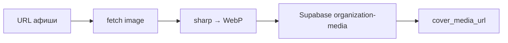

# TASK-019 · WebP афиш + устойчивый Groq (429)

**Цель:** лёгкие постеры в Storage и парсинг, который не валит ingest при rate limit Groq.

**Код:** `server/utils/contentCoverMedia.ts`, `server/utils/coverWebpCompress.ts`, `server/utils/ai/groqEventParser.ts`, `server/utils/ai/groqParseErrors.ts`, `server/utils/contentIngestCore.ts`

---

## Как это работает

### WebP при ingest



1. При ingest (`runContentIngest`) и при **publish** (`publishContentSubmission`) вызывается `resolveIngestCoverMediaUrl`.
2. Картинка скачивается (таймаут 12 с, макс. 5 MB на вход).
3. `compressImageToWebp` ужимает до **≤ 300 KB** (ширина до ~1200px, итерация quality).
4. В Storage кладётся **`image/webp`**, путь `inuu-content/{cityId}/….webp`.
5. Если transcode/upload не удался — **fallback**: в payload остаётся внешний URL (`stored: false`), ingest не падает.

**Проверка «уже на storage»:** при publish mirror пропускается, если URL уже содержит `/storage/v1/object/public/organization-media/`.

### Groq cascade и 429

1. Цепочка моделей: `NUXT_GROQ_MODEL` (по умолчанию **70b**) → `NUXT_GROQ_CLASSIFIER_MODEL` (по умолчанию **8b**).
2. На каждой модели до 2 попыток; при **429** переключение на следующую модель.
3. Если все модели исчерпаны с rate limit:
   - `GroqParseExhaustedError` с `rateLimited: true`;
   - ingest возвращает `parseDegraded: true`, `moderationStatus: needs_revision`, **HTTP 200** (не 500);
   - `writeAiParseLog` с `status: failed`, `errorMessage: groq_rate_limited`, payload `{ groq_rate_limited, modelsTried, attempts }`.

---

## Где смотреть в UI

| Что | Прод | Локально |
|-----|------|----------|
| Тест парсера + ingest (блок «AI parse / ingest») | [dashboard/content-ai](https://inuu.ru/dashboard/content-ai) | [localhost:3000/dashboard/content-ai](http://localhost:3000/dashboard/content-ai) |
| Афиша — обложки событий | [ulan-ude/events](https://inuu.ru/ulan-ude/events) | [localhost:3000/ulan-ude/events](http://localhost:3000/ulan-ude/events) |
| Детальная — большая афиша | [ulan-ude/events/{slug}](https://inuu.ru/ulan-ude/events) | [localhost:3000/ulan-ude/events/{slug}](http://localhost:3000/ulan-ude/events/{slug}) |

На карточке: Network → запрос к `cover_media_url` должен вести на **Supabase storage** (не `telesco.pe` / внешний CDN), тип **webp**.

---

## Как проверить

### 1. WebP после ingest

**Через dashboard (проще всего)**

1. Открыть [content-ai (локально)](http://localhost:3000/dashboard/content-ai), выбрать город `ulan-ude`.
2. Вставить текст поста **с URL картинки** в «AI parse / ingest», включить **Persist**.
3. После успеха — открыть афишу или детальную опубликованного события.

**Через API**

```bash
# локально; при NUXT_INGEST_SECRET добавить -H "x-ingest-secret: …"
curl -s -X POST "http://localhost:3000/api/ingest/content/submit" \
  -H "Content-Type: application/json" \
  -d '{
    "rawText": "Концерт 15 июня 19:00. Билеты: https://example.com\nАфиша: https://upload.wikimedia.org/wikipedia/commons/thumb/4/47/PNG_transparency_demonstration_1.png/320px-PNG_transparency_demonstration_1.png",
    "sourceKind": "manual_editor",
    "citySlug": "ulan-ude",
    "persist": true
  }' | jq '{ok, eventsCount, model, parseDegraded}'
```

**Ожидание в БД** (Supabase → `events` или `content_submissions.payload`):

- `cover_media_url` содержит `organization-media` и часто **`.webp`**;
- размер объекта в Storage **< 300 KB** (Storage → bucket `organization-media` → папка `inuu-content/`).

**Прод:** тот же запрос на `https://inuu.ru/api/ingest/content/submit` (нужны env и секреты на Vercel).

### 2. Mirror на publish

1. Создать submission с **внешним** `cover_media_url` (не storage).
2. Опубликовать через модерацию (✅ Опубликовать).
3. В `events.cover_media_url` после approve — URL storage webp (если fetch прошёл).

### 3. Groq 429 (деградация)

Полный 429 на staging сложно воспроизвести без mock. Проверки:

| Уровень | Как |
|---------|-----|
| Unit | `npm test` → `tests/groqParseErrors.spec.ts` |
| Логи | Supabase / dashboard: таблица `ai_parse_logs`, `error_message = groq_rate_limited` |
| API | Ответ submit: `parseDegraded: true`, `warning` с текстом про rate limit |

При деградации submission **не создаётся** с полным разбором события — очередь ждёт повторного ingest или ручной доработки.

### 4. Регрессия

```bash
npm test
# contentCoverMedia, coverWebpCompress, groqParseErrors
```

---

## Переменные окружения

| Переменная | Назначение |
|------------|------------|
| `NUXT_GROQ_API_KEY` | Groq API |
| `NUXT_GROQ_MODEL` | Основная модель (70b) |
| `NUXT_GROQ_CLASSIFIER_MODEL` | Fallback при 429 (8b) |
| `SUPABASE_URL` + service key | Upload в Storage |
| `NUXT_INGEST_SECRET` | Опционально для submit |

---

## Типичные проблемы

| Симптом | Причина | Что делать |
|---------|---------|------------|
| Внешний URL в `cover_media_url` | fetch 403/timeout или sharp fail | Проверить логи `[contentCoverMedia]`; повтор publish |
| Не webp | исходник уже маленький webp / sharp недоступен на runtime | Проверить `sharp` на Vercel; `nitro.externals.inline` |
| 422 вместо degraded | не rate limit, а битый JSON от Groq | Смотреть `attempts` в ошибке; поправить текст поста |
| 500 на submit | другая ошибка (город, env) | Логи сервера, не связано с 429-path |

---

## Ссылки

- Спека: [32-stable-cover-media-pipeline.md](../features/content/32-stable-cover-media-pipeline.md)
- Чеклист MVP: [24-mvp-launch-checklist-ulan-ude.md](../features/content/24-mvp-launch-checklist-ulan-ude.md)
- Индекс 3b: [WAVE_3B_README.md](./WAVE_3B_README.md)
