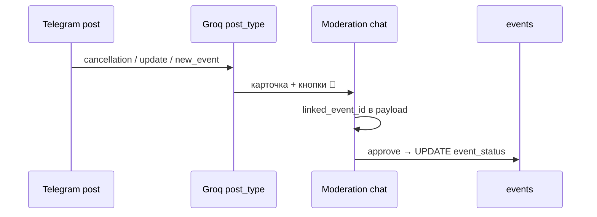

# TASK-020 · Статусы события на витрине (отмена / sold out / перенос)

**Цель:** пользователь видит статус на карточке; отменённые события **не исчезают** с афиши; модератор вручную привязывает пост к существующему событию.

**Код:** `047_events_lifecycle_status.sql`, `eventLifecycleStatus.ts`, `eventModerationLink.ts`, `contentSubmissionPublish.ts`, `inuuContentModeration.ts`, `CityEventCard.vue`, `pages/[city_slug]/events/[slug].vue`

---

## Как это работает

### Поля в БД

| Поле | Значения |
|------|----------|
| `events.event_status` | `active` (default), `cancelled`, `sold_out`, `postponed` |
| `status_updated_at` | когда обновили статус |
| `status_note` | короткий текст из поста (опционально) |

Миграция: [047_events_lifecycle_status.sql](../../supabase/migrations/047_events_lifecycle_status.sql).

### Ingest → модерация → publish



1. Groq возвращает `post_type`: `new_event` | `cancellation` | `update` | `trash`.
2. Для `update` дополнительно `update_kind`: `sold_out` | `reschedule` | `other`.
3. Submission сохраняется с `ingest_post_type`, `ingest_update_kind` в payload.
4. **Не `new_event`:** в карточке модерации — до 5 кнопок **🔗 {название}** (кандидаты из недавних published events).
5. Модератор жмёт 🔗 → в payload пишется `linked_event_id`.
6. **✅ Опубликовать** для cancel/update:
   - без `linked_event_id` → ошибка «Сначала привяжите событие»;
   - с привязкой → **UPDATE** строки `events`, не INSERT.
7. Кнопка **⛔ Отменить в базе** (только для `cancellation` после привязки): сразу `event_status = cancelled` без полного publish-flow.

### Маппинг статусов при approve

| post_type | update_kind | event_status |
|-----------|-------------|--------------|
| cancellation | — | `cancelled` |
| update | `sold_out` | `sold_out` |
| update | `reschedule` / `other` | `postponed` (+ `starts_at` из payload при reschedule) |
| new_event | — | INSERT как раньше (`active`) |

### Витрина

- API ленты: события с `event_status` ≠ active **остаются** в выдаче (фильтр: будущие **или** не-active статус).
- **CityEventCard:** бейдж на афише (Отменено / Sold out / Перенесено).
- **Детальная:** плашка под заголовком; CTA билетов **скрыт** при `cancelled` и `sold_out`.

---

## Страницы для тестирования

| Сценарий | Прод | Локально |
|----------|------|----------|
| Лента — бейджи на карточках | [inuu.ru/ulan-ude/events](https://inuu.ru/ulan-ude/events) | [localhost:3000/ulan-ude/events](http://localhost:3000/ulan-ude/events) |
| Главная — блок событий | [inuu.ru/ulan-ude](https://inuu.ru/ulan-ude) | [localhost:3000/ulan-ude](http://localhost:3000/ulan-ude) |
| Детальная — плашка + CTA | [inuu.ru/ulan-ude/events/{slug}](https://inuu.ru/ulan-ude/events) | [localhost:3000/ulan-ude/events/{slug}](http://localhost:3000/ulan-ude/events/{slug}) |
| Dashboard (тест ingest) | [dashboard/content-ai](https://inuu.ru/dashboard/content-ai) | [localhost:3000/dashboard/content-ai](http://localhost:3000/dashboard/content-ai) |
| Модерация | Telegram **moderation chat** | тот же бот + chat id из dashboard |

---

## Пошаговая проверка (E2E)

### Подготовка

1. Применить миграцию **047**.
2. `npm run dev` → [content-ai](http://localhost:3000/dashboard/content-ai).
3. В TG настроены `moderation_chat_id` и токен бота (`NUXT_BOT_TOKEN`).
4. В афише есть **опубликованное** событие на будущую дату — запомнить **title** / **slug**.

### Сценарий A: Отмена

1. Отправить в канал-источник (или ingest вручную) текст вида:  
   `«Концерт X отменён. Билеты не продаются.»`
2. Дождаться карточки в moderation chat → строка **⚠️ Тип поста: Отмена / закрытие**.
3. Нажать кнопку **🔗** с нужным событием из списка → «Событие привязано».
4. **✅ Опубликовать** (или **⛔ Отменить в базе** для быстрого cancel).
5. Открыть [афишу (локально)](http://localhost:3000/ulan-ude/events) — карточка **на месте**, бейдж **«Отменено»** (красный).
6. Открыть детальную — плашка «Отменено», **нет** кнопки 🎟/🌐.

**API-проверка:**

```bash
curl -s "http://localhost:3000/api/cities/ulan-ude/events?limit=20" \
  | jq '.items[] | select(.event_status != "active") | {title, slug, event_status}'
```

### Сценарий B: Sold out

1. Ingest/post с текстом «распродано / sold out» → `post_type: update`, `update_kind: sold_out`.
2. Привязать событие → approve.
3. На карточке бейдж **«Sold out»** (тёмный), CTA скрыт.

### Сценарий C: Перенос

1. Post с новой датой + «перенос» → `update_kind: reschedule`.
2. Привязка → approve → бейдж **«Перенесено»** (янтарный); при наличии дат в payload — обновлён `starts_at`.

### Негативные кейсы

| Действие | Ожидание |
|----------|----------|
| Approve cancel **без** 🔗 | Alert: «Сначала привяжите событие» |
| `post_type: trash` | Не публикуется, skip ingest |
| Approve `new_event` | Как раньше — новая строка в `events`, `event_status = active` |

---

## Проверка через SQL

```sql
SELECT slug, title, event_status, status_updated_at, starts_at
FROM events
WHERE city_id = (SELECT id FROM cities WHERE slug = 'ulan-ude')
  AND event_status != 'active'
ORDER BY status_updated_at DESC
LIMIT 10;
```

```sql
SELECT id, status, payload->>'ingest_post_type' AS post_type,
       payload->>'linked_event_id' AS linked
FROM content_submissions
WHERE payload->>'ingest_post_type' IN ('cancellation', 'update')
ORDER BY created_at DESC
LIMIT 5;
```

---

## Unit-тесты

```bash
npm test -- tests/eventLifecycleStatus.spec.ts tests/eventIngestPostType.spec.ts
```

---

## Out of scope (не ждать в 3b)

- Автоматический fuzzy-match отмены по title без модератора.
- Авто-отмена события только из weekend alert (alert → ручное действие модератора).

---

## Ссылки

- [16-parsing-pipeline-extensions.md](../features/content/16-parsing-pipeline-extensions.md)
- [15-event-detail-series-venues.md](../features/content/15-event-detail-series-venues.md)
- Индекс: [WAVE_3B_README.md](./WAVE_3B_README.md)
