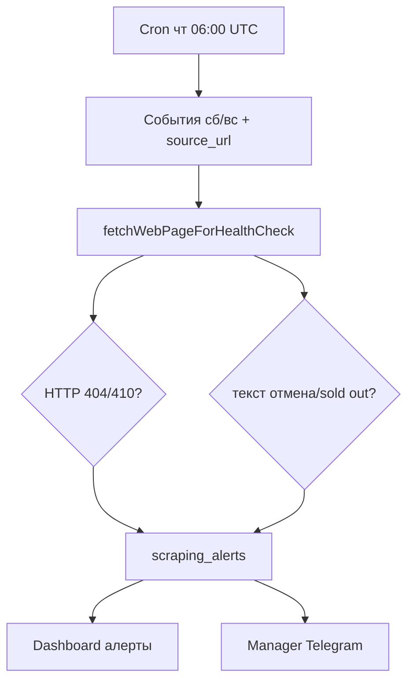

# TASK-021 · Проверка источников перед выходными

**Цель:** до выходных увидеть расхождение между **страницей источника** и **опубликованным событием** у нас (404, отмена на сайте).

**Код:** `sourceWeekendHealthCheck.ts`, `server/api/cron/source-weekend-check.post.ts`, `scrapingAlerts.ts`, `webPageFetch.ts`, миграция [048](../../supabase/migrations/048_scraping_alerts_event_id.sql)

Краткий ops-runbook: [SOURCE_WEEKEND_CHECK.md](./SOURCE_WEEKEND_CHECK.md).

---

## Как это работает



1. Cron `POST /api/cron/source-weekend-check` (расписание в [vercel.json](../../vercel.json): **четверг 06:00 UTC**).
2. Для каждого активного города выбираются **published** события с `starts_at` на **ближайшие субботу/воскресенье** (в TZ города), у которых в `source_metadata` есть `source_url`.
3. URL запрашивается **напрямую** (обход `shouldSkipCrawl` ingest-dedupe).
4. Создаётся open alert (без дубля на пару `event_id` + `reason`):

| reason | Условие |
|--------|---------|
| `source_404` | HTTP 404 или 410 |
| `source_empty` | HTTP ≥ 400 (кроме 404/410) |
| `source_cancelled_on_site` | regex: отмена, sold out, распродан, … |

5. Опционально — сообщение в **manager chat** (Telegram).
6. Модератор смотрит dashboard, resolve alert, при необходимости отменяет событие через [TASK-020](./WAVE_3B_TASK-020-event-status.md).

**Важно:** `web_source_id` в alert может быть `null` (привязка только через `event_id`).

---

## Страницы и API для тестирования

| Что | Прод | Локально |
|-----|------|----------|
| Алерты + источники | [dashboard/content-ai](https://inuu.ru/dashboard/content-ai) | [localhost:3000/dashboard/content-ai](http://localhost:3000/dashboard/content-ai) |
| Событие по ссылке из alert | [ulan-ude/events/{slug}](https://inuu.ru/ulan-ude/events) | [localhost:3000/ulan-ude/events/{slug}](http://localhost:3000/ulan-ude/events/{slug}) |
| Cron endpoint | `https://inuu.ru/api/cron/source-weekend-check` | `http://localhost:3000/api/cron/source-weekend-check` |

---

## Подготовка

1. Миграция **048** применена.
2. `NUXT_CRON_WEB_SOURCES_SECRET` задан локально / на Vercel.
3. В `events` есть событие:
   - `is_published = true`;
   - `starts_at` попадает на **ближайшие выходные**;
   - `source_metadata.source_url` = тестовый URL.
4. На [content-ai](http://localhost:3000/dashboard/content-ai) выбран город **ulan-ude**.

---

## Ручной запуск cron

```bash
# локально
export APP_URL=http://localhost:3000
export NUXT_CRON_WEB_SOURCES_SECRET=your_secret

curl -s -X POST "$APP_URL/api/cron/source-weekend-check" \
  -H "x-cron-secret: $NUXT_CRON_WEB_SOURCES_SECRET" \
  | jq .
```

**Ожидаемый ответ:**

```json
{
  "ok": true,
  "checked": 3,
  "alerts": 1,
  "errors": 0
}
```

**Прод:**

```bash
export APP_URL=https://inuu.ru
curl -s -X POST "$APP_URL/api/cron/source-weekend-check" \
  -H "x-cron-secret: $NUXT_CRON_WEB_SOURCES_SECRET"
```

---

## Сценарии проверки

### 1. HTTP 404 на странице источника

1. Взять published событие на выходные с `source_url`.
2. Временно подставить в БД несуществующий URL (или использовать staging URL с 404).
3. Запустить cron (см. выше).
4. На [content-ai](http://localhost:3000/dashboard/content-ai) → блок **«Алерты парсинга»**:
   - `reason`: `source_404`;
   - ссылка **Событие:** на витрину;
   - кнопка **Resolve**.

### 2. «Отмена» на странице источника

1. `source_url` на страницу с текстом «мероприятие отменено» / «sold out».
2. Cron → alert `source_cancelled_on_site`.
3. Сверить с Telegram manager chat (если `manager_chat_id` настроен).

### 3. Дедупликация

1. Дважды запустить cron с тем же событием и той же причиной.
2. В dashboard — **один** open alert на `event_id` + `reason`.

### 4. Resolve

1. Нажать **Resolve** в dashboard.
2. Повторный cron не должен создавать новый open alert (пока проблема не воспроизведётся снова после resolve).

---

## API алертов (dashboard)

```bash
# нужна сессия менеджера в браузере или service role только на сервере
curl -s "http://localhost:3000/api/dashboard/manager/cities/ulan-ude/ingest-sources/scraping-alerts" \
  --cookie "your_session_cookie" \
  | jq '.alerts[] | {reason, eventTitle, eventSlug, url}'
```

В UI проще смотреть на [content-ai](http://localhost:3000/dashboard/content-ai).

---

## SQL

```sql
SELECT a.reason, a.url, a.event_id, e.slug, e.title, a.created_at, a.resolved_at
FROM scraping_alerts a
LEFT JOIN events e ON e.id = a.event_id
WHERE a.resolved_at IS NULL
ORDER BY a.created_at DESC
LIMIT 20;
```

---

## Календарь (ops)

| Когда | Действие |
|-------|----------|
| **Чт** после 06:00 UTC (~14:00 Иркутск) | Автозапуск cron |
| **Чт–пт** | Просмотр [dashboard/content-ai](https://inuu.ru/dashboard/content-ai) |
| Перед выходными | Resolve или отмена события в базе (TASK-020) |

---

## Отличие от nightly web crawl

| | `web-sources-crawl` | `source-weekend-check` |
|--|---------------------|-------------------------|
| Расписание | ежедневно 19 UTC | чт 06 UTC |
| Цель | новый ingest с сайта | сверка уже published |
| Dedupe | пропускает `event_published` | **не** пропускает |
| Алерты | parse errors | 404 / отмена на сайте |

---

## Тесты

```bash
npm test -- tests/webPageHealthCheck.spec.ts
```

---

## Ссылки

- [SOURCE_WEEKEND_CHECK.md](./SOURCE_WEEKEND_CHECK.md)
- [WEB_URL_PARSER_RU.md](./WEB_URL_PARSER_RU.md) — web-источники
- [WAVE_3B_TASK-020-event-status.md](./WAVE_3B_TASK-020-event-status.md) — отмена в базе
- Индекс: [WAVE_3B_README.md](./WAVE_3B_README.md)
