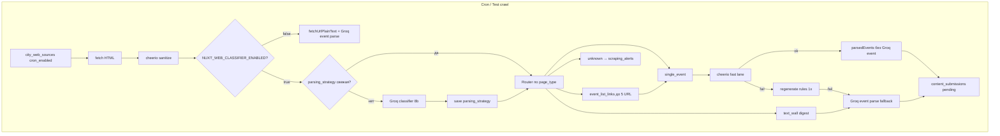

# Web-парсинг URL: как устроен и как добавлять источники

Краткая инструкция для менеджеров контента и разработчиков.  
Техническая спека: [26-web-scraping-classifier-and-rules.md](../features/content/26-web-scraping-classifier-and-rules.md) · контекст источников: [17-ingest-sources-context.md](../features/content/17-ingest-sources-context.md) · runbook разработки: [TASK-008-web-parsing-pipeline.md](../tracker/TASK-008-web-parsing-pipeline.md).

---

## Есть ли dashboard?

**Да.** Управление web- и Telegram-источниками — на странице менеджера:

| | |
|---|---|
| **URL** | `/dashboard/content-ai` |
| **Файл** | `pages/dashboard/content-ai.vue` |
| **Блок UI** | «Источники парсинга (Web + Telegram)» — компонент `components/dashboard/DashboardIngestSourcesPanel.vue` |

Доступ: пользователь с **manager scope** по городу (привязка через `shop_members` к организации в этом городе).

На той же странице рядом:
- настройки TG/MAX чатов города;
- тест AI parse / ingest;
- очередь `content_submissions` (approve / reject).

---

## Что хранится в БД

### Web-источники — `city_web_sources`

| Поле | Назначение |
|------|------------|
| `url` | Страница афиши (уникальна в паре с `city_id`) |
| `context_type` | Контекст для Groq: `theater`, `club`, `standup`, `museum`, `cinema`, `library`, `general` |
| `organization_id` | Привязка к `shops` (организация). Если пусто — при первом парсе создаётся **теневая** org |
| `cron_enabled` | Участвует в ночном cron (`true` / `false`) |
| `is_active` | Источник включён |
| `parsing_strategy` | Кэш классификатора: `page_type`, `list_link_pattern`, `classified_at`, … |
| `parsing_rules` | CSS-селекторы для fast lane (cheerio) |
| `rules_validated_at` | Когда fast lane последний раз успешно отработал |
| `last_crawled_at` | Время последнего обхода |

Миграции: `036_city_ingest_sources.sql`, `039_web_parsing_strategy.sql`.

### Алерты — `scraping_alerts`

Записи, когда страницу не удалось разобрать (`unknown`, `rules_failed`, `empty_page`). В dashboard — блок «Алерты парсинга»; кнопка **Resolve** закрывает алерт.

### Telegram-источники — `city_telegram_sources`

Парсятся **userbot**-воркером (`workers/telegram-userbot/`), не web-cron. В том же dashboard: вкладка «Telegram-источники».

---

## Как добавить новый URL (менеджер)

1. Открыть **[/dashboard/content-ai](https://inuu.ru/dashboard/content-ai)** (или локально `http://localhost:3000/dashboard/content-ai`).
2. Выбрать **город** в селекте сверху.
3. В блоке **«Web-источники (cron)»** → **«+ Добавить сайт»**.
4. Заполнить форму:

| Поле | Рекомендация |
|------|----------------|
| **URL афиши** | Прямая ссылка на список событий или главную афишу, `https://…` |
| **Контекст для Groq** | `theater` / `club` / … — влияет на system prompt |
| **Организация** | Выбрать существующую org или оставить пустым → **теневая org при первом парсе** |
| **Cron enabled** | Включить только после успешного **«Проверить»** (test crawl) |
| **Активен** | Обычно `да` |

5. **«Проверить»** — dry-run без записи в очередь (`persist: false`). JSON с результатом внизу страницы.
6. **«Запустить»** — ручной прогон как cron: `persist: true`, submission в `content_submissions` (и теневая org при необходимости).
7. Если результат ок — включить **Cron enabled** для ночного автозапуска.

### Привязка организации

- **Сразу:** в форме выбрать org из списка (подтягивается `GET …/shops`).
- **Теневая org:** оставить организацию пустой → при первом успешном парсе вызывается `create-shadow-org` (кнопка **Shadow org** в таблице или автоматически в cron).
- Теневая org помечена плашкой «теневая» (`ui_settings.is_claimed = false`).

### После добавления URL

Под строкой источника в таблице (если уже был classify):

- **strategy:** `page_type` и дата classify;
- **parsing_rules** (read-only JSON);
- **Сбросить strategy** — обнулить кэш классификатора и rules (переклассификация на следующем cron);
- **Reset rules** — только селекторы fast lane.

---

## Как работает парсер (технически)

Cron: `POST /api/cron/web-sources-crawl` · расписание в `vercel.json` — **19:00 UTC** ежедневно (`0 19 * * *`).



### Ключевые файлы

| Слой | Файлы |
|------|--------|
| Cron API | `server/api/cron/web-sources-crawl.post.ts` |
| Test crawl | `server/api/dashboard/manager/cities/[slug]/ingest-sources/web/[id]/test-crawl.post.ts` |
| Оркестрация | `server/utils/webCrawlRouter.ts`, `server/utils/webCrawlHelpers.ts` |
| Fetch / sanitize | `server/utils/webPageFetch.ts`, `server/utils/webPageSanitizer.ts` |
| Classifier | `server/utils/ai/groqWebPageClassifier.ts` |
| Rules | `server/utils/ai/groqParsingRulesGenerator.ts`, `server/utils/webParsingRulesApply.ts` |
| Ingest | `server/utils/contentIngestCore.ts` (`parsedEvents` = fast lane) |
| Dedupe | `server/utils/ingestDedupe.ts` |
| Dashboard API | `server/api/dashboard/manager/cities/[slug]/ingest-sources/*` |

### Типы страниц (`page_type`)

| Тип | Поведение |
|-----|-----------|
| `single_event` | Одна страница события → fast lane или fallback Groq |
| `event_list_links` | Список ссылок → до **5** дочерних URL за один прогон cron |
| `text_wall` | Много событий в одном тексте → digest parse (Groq) |
| `unknown` | Алерт, **без** submission |

Классификатор вызывается повторно, если нет strategy, она старше **30 дней**, или `fail_count >= 2`.

---

## Переменные окружения

| Переменная | Назначение |
|------------|------------|
| `NUXT_CRON_WEB_SOURCES_SECRET` | Секрет для cron (`header: x-cron-secret`) |
| `NUXT_GROQ_API_KEY` | Groq (classifier + event parse + rules generator) |
| `NUXT_GROQ_CLASSIFIER_MODEL` | По умолчанию `llama-3.1-8b-instant` |
| `NUXT_GROQ_MODEL` | Event parse, по умолчанию `llama-3.3-70b-versatile` |
| `NUXT_WEB_CLASSIFIER_ENABLED` | `true` / `1` — новый pipeline; иначе legacy plain text |
| `FIRECRAWL_API_KEY` | Опционально: fetch сложных страниц |

На **dev** перед боевым cron включить classifier и прогнать 2 URL вручную (см. [ACTIVE_TASKS.md](../tracker/ACTIVE_TASKS.md)).

---

## API dashboard (для автоматизации)

Базовый префикс: `/api/dashboard/manager/cities/{slug}/ingest-sources`

| Метод | Путь | Действие |
|-------|------|----------|
| GET | `/ingest-sources` | Список web + TG + prefilter |
| POST | `/ingest-sources/web` | Создать web-источник |
| PUT | `/ingest-sources/web/{id}` | Обновить |
| DELETE | `/ingest-sources/web/{id}` | Удалить |
| POST | `/ingest-sources/web/{id}/test-crawl` | Тестовый прогон (`persist: false`) |
| POST | `/ingest-sources/web/{id}/run-crawl` | Ручной запуск парсера (`persist: true`) |
| POST | `/ingest-sources/web/{id}/create-shadow-org` | Создать теневую org |
| POST | `/ingest-sources/web/{id}/reset-strategy` | Сброс strategy + rules |
| POST | `/ingest-sources/web/{id}/reset-rules` | Сброс только rules |
| GET | `/ingest-sources/scraping-alerts` | Открытые алерты |
| POST | `/ingest-sources/scraping-alerts/{id}/resolve` | Закрыть алерт |

Аналогично для Telegram: `/ingest-sources/telegram`, `/telegram/{id}`.

---

## Добавление URL через SQL (редко)

Только если нет доступа к dashboard:

```sql
insert into city_web_sources (city_id, url, context_type, cron_enabled, is_active, notes)
select id, 'https://example.org/afisha', 'theater', false, true, 'ручной seed'
from cities where slug = 'ulan-ude'
on conflict (city_id, url) do update set context_type = excluded.context_type;
```

Сначала `cron_enabled = false`, после проверки в UI — `true`.

---

## Чеклист перед включением cron

- [ ] Миграции `036`–`039` применены на окружении
- [ ] Test crawl возвращает осмысленный parse (не `skipped by prefilter`)
- [ ] Для classifier: `NUXT_WEB_CLASSIFIER_ENABLED=true`
- [ ] Org привязана или осознанно теневая
- [ ] Нет открытых `scraping_alerts` с `unknown` на этом URL (или разобраны)
- [ ] Пре-фильтр города: toggle в dashboard (обычно включён)

---

## Куда попадает результат

1. `content_submissions` со статусом `pending` или `needs_revision`
2. Модерация в TG-чате города и/или блок очереди на `/dashboard/content-ai`
3. После approve → публикация события (`parsed`, CTA «купить на сайте организатора»)

Дубликаты: не создаётся новая submission, если уже есть запись с тем же `source_url` / `source_external_id` или опубликованное событие с тем же URL (`ingestDedupe.ts`).

---

## Связанные документы

- [04-dashboard-pages-ai-and-city-ops.md](../implementation/04-dashboard-pages-ai-and-city-ops.md) — обзор страницы content-ai
- [MANAGER_CONTENT_RUNBOOK_RU.md](./MANAGER_CONTENT_RUNBOOK_RU.md) — ежедневный цикл модерации
- [workers/telegram-userbot/README.md](../../workers/telegram-userbot/README.md) — TG-каналы (не web-cron)
