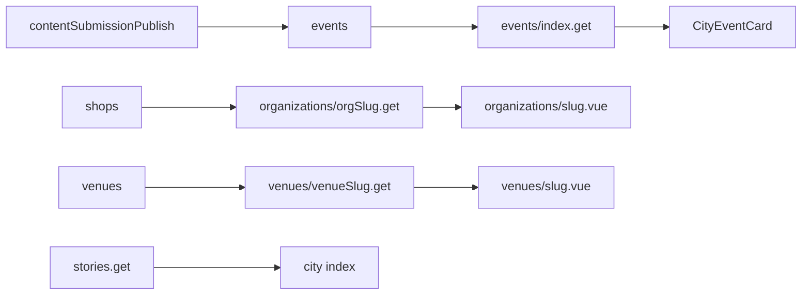

# TASK-003 · Публичные org/venue и афиша на витрине

Исполняемый runbook для одного фокусированного чата Cursor (~75% контекста).  
Краткий scope и статус — в [ACTIVE_TASKS.md](./ACTIVE_TASKS.md).

**Статус задачи:** `done` (31.05.2026).

---

## Связи

| Документ | Зачем |
|----------|--------|
| [ACTIVE_TASKS.md](./ACTIVE_TASKS.md) | Scope, in/out, критерии готовности |
| [FEATURE_MATRIX.md](./FEATURE_MATRIX.md) | §2 CTA native/parsed · §3 org page · §3 venue afisha · §6 stories |
| [15-event-detail-series-venues.md](../features/content/15-event-detail-series-venues.md) | `venue_id`, org, блок «источник» |
| [17-ingest-sources-context.md](../features/content/17-ingest-sources-context.md) | native vs parsed, теневые org |
| [21-mini-app-and-web-wireframes.md](../features/content/21-mini-app-and-web-wireframes.md) | 🎟 / 🌐 на карточках |
| [03-core-platform.md](../03-core-platform.md) | Stories на главной |

**Зависимости:**

- **TASK-002** (web-cron + теневые `shops`) — желателен до волны 3: иначе parsed-события остаются на `shop_id = inuu-editorial` и org-страница пустая.
- **TASK-001** — не блокер UI; влияет только на качество/объём parsed-контента в БД.

---

## Терминология в коде

| В спеках / задаче | В репозитории |
|-------------------|---------------|
| `organization_id` | `events.shop_id` → таблица `public.shops` |
| Публичный URL org | `/[city_slug]/organizations/[slug]` (маппинг на `shops.slug`) |
| Parsed / native | `events.source_channel` (= `content_submissions.source_kind` при publish) |

Миграция отдельной таблицы `organizations` **не нужна** для этой задачи.

---

## Gap: что уже есть

| Область | Готово | Нужно сделать |
|---------|--------|---------------|
| Venue API | [server/api/cities/[slug]/venues/[venueSlug].get.ts](../../server/api/cities/[slug]/venues/[venueSlug].get.ts) — `upcomingEvents` (limit 8) | Limit 24, поля для `CityEventCard`, grid на странице |
| Venue UI | [pages/[city_slug]/venues/[slug].vue](../../pages/[city_slug]/venues/[slug].vue) — список ссылок «События здесь» | Сетка карточек + те же CTA, что в ленте |
| Event detail | [pages/[city_slug]/events/[slug].vue](../../pages/[city_slug]/events/[slug].vue) — текст org, две кнопки без 🎟/🌐 | Кликабельные org/venue, CTA по `saleMode` |
| Event list API | [server/api/cities/[slug]/events/index.get.ts](../../server/api/cities/[slug]/events/index.get.ts) — `source_metadata` в select | `saleMode`, `cta`, `organization`, `venue` |
| Карточка | [components/city/CityEventCard.vue](../../components/city/CityEventCard.vue) | Footer CTA native/parsed |
| Stories | [pages/[city_slug]/index.vue](../../pages/[city_slug]/index.vue), [composables/useCityStories.ts](../../composables/useCityStories.ts), [server/api/cities/[slug]/stories.get.ts](../../server/api/cities/[slug]/stories.get.ts) | Скрыть пустую полоску; smoke seed |
| Org page | — | [x] API + `pages/[city_slug]/organizations/[slug].vue` |

**Блокер org-страницы:** [contentSubmissionPublish.ts](../../server/utils/contentSubmissionPublish.ts) сейчас всегда ставит `shop_id` из `inuu-editorial`. Без TASK-002 или publish-bridge (волна 3) критерий «parsed → страница org» не выполнится.

---

## Архитектура



---

## Out of scope

- Подписка на org (push)
- Claim org в личном кабинете
- Chips дат / «похожие события» на деталке
- Cron-подборки
- Mini App tab bar (TASK-005)
- ЮKassa checkout / hold (TASK-005 / ticketing)

---

## Волна 1 · `saleMode` и обогащение API

**Цель:** единый контракт для ленты, главной и деталки.

### 1.1 Новый модуль `server/utils/eventSaleMode.ts`

```ts
// Концепт (реализовать в репо)
export type EventSaleMode = 'native' | 'parsed'

const PARSED_CHANNELS = new Set([
  'telegram_parse',
  'web_cron',
  'vk_parse',
  // при появлении новых ingest — добавить сюда
])

export function resolveEventSaleMode(row: {
  source_channel?: string | null
  shop_id?: string | null
}): EventSaleMode {
  const ch = String(row.source_channel || '').trim()
  if (PARSED_CHANNELS.has(ch)) return 'parsed'
  return 'native'
}

export function resolveEventCta(args: {
  saleMode: EventSaleMode
  registrationUrl?: string | null
  sourceUrl?: string | null
}): { label: string; url: string | null; emoji: '🎟' | '🌐' } {
  if (args.saleMode === 'parsed') {
    return {
      emoji: '🌐',
      label: 'На сайт',
      url: args.sourceUrl || args.registrationUrl || null,
    }
  }
  return {
    emoji: '🎟',
    label: 'Купить',
    url: args.registrationUrl || args.sourceUrl || null,
  }
}
```

Источник URL: `parseSourceMetadata` из [server/utils/eventPublicDetail.ts](../../server/utils/eventPublicDetail.ts) (`registration_url`, `source_url`).

### 1.2 Расширить `eventPublicDetail.ts`

- Экспорт `resolveEventDisplayLinks(row)` → `{ saleMode, cta, sourceLabel?, sourceUrl? }`
- `sourceLabel`: `@channel` из metadata или human-readable `source_channel`

### 1.3 Обновить handlers

| Файл | Изменения |
|------|-----------|
| [events/index.get.ts](../../server/api/cities/[slug]/events/index.get.ts) | `select`: +`shop_id`, `source_channel`; в каждом item: `saleMode`, `cta`, `organization?`, `venue?` |
| [home.get.ts](../../server/api/cities/[slug]/home.get.ts) | То же для блока `events` |
| [events/[eventSlug].get.ts](../../server/api/cities/[slug]/events/[eventSlug].get.ts) | `organization: { slug, name }`, `venue` с slug, `saleMode`, `cta`, `sourceDisplay` |

**Join org/venue (batch после select):**

```ts
// Псевдокод: собрать уникальные shop_id / venue_id из rows → один запрос shops/venues → map
```

**DTO item (для фронта):**

```json
{
  "id": "...",
  "slug": "...",
  "title": "...",
  "starts_at": "...",
  "saleMode": "parsed",
  "cta": { "emoji": "🌐", "label": "На сайт", "url": "https://..." },
  "organization": { "slug": "teatr-buryatii", "name": "Театр ..." },
  "venue": { "slug": "...", "title": "..." }
}
```

### 1.4 Проверка волны 1

```bash
curl -s "http://localhost:3000/api/cities/ulan-ude/events?limit=3" | jq '.items[0] | {saleMode, cta, organization}'
curl -s "http://localhost:3000/api/cities/ulan-ude/events/SOME_SLUG" | jq '{saleMode, organization, venue}'
```

---

## Волна 2 · Карточки и деталка события

### 2.1 `CityEventCard.vue`

- Новые опциональные props: `saleMode`, `cta` (или плоские `ctaUrl`, `ctaLabel`, `ctaEmoji`)
- Footer под ценой:
  - `parsed` → outline кнопка «🌐 На сайт»
  - `native` → primary «🎟 Купить»
- `@click.stop` на `<a>` — клик по CTA не уводит на деталку; клик по карточке — как сейчас на `/events/[slug]`
- Если `cta.url` пустой — не показывать footer (только переход на деталку)

### 2.2 `pages/[city_slug]/events/[slug].vue`

- Организатор: `NuxtLink` → `${cityBasePath}/organizations/${slug}` если API отдал `organization.slug`
- Иначе: «Источник: @channel» → внешняя ссылка `source_url`
- Venue: `NuxtLink` → `${cityBasePath}/venues/${slug}` если есть `venues.slug` в ответе
- Блок CTA: те же emoji/labels, что на карточке ([21-mini-app wireframes](../features/content/21-mini-app-and-web-wireframes.md))

### 2.3 Потребители карточки (прокинуть поля из API)

- [pages/[city_slug]/events/index.vue](../../pages/[city_slug]/events/index.vue)
- [pages/[city_slug]/index.vue](../../pages/[city_slug]/index.vue)
- [pages/[city_slug]/tag/[tagSlug].vue](../../pages/[city_slug]/tag/[tagSlug].vue)
- [pages/[city_slug]/lists/[slug].vue](../../pages/[city_slug]/lists/[slug].vue) — если `item.event` приходит из list API, обогатить list endpoint или маппить на клиенте (минимальный scope: только events index + home)

### 2.4 Проверка волны 2

- `/ulan-ude/events` — у parsed-событий видна «🌐 На сайт», у native (когда появятся) — «🎟 Купить»
- Деталка: клик по организатору/месту ведёт на org/venue (если slug есть)

---

## Волна 3 · Страница организатора

### 3.1 API `server/api/cities/[slug]/organizations/[orgSlug].get.ts`

- `resolveCityBySlug` + service role (как [venues/[venueSlug].get.ts](../../server/api/cities/[slug]/venues/[venueSlug].get.ts))
- `shops`: `city_id`, `slug`, `is_active = true`
- Исключить или пометить `inuu-editorial` (редакция — не B2C org-витрина): 404 для slug `inuu-editorial` или флаг в ответе `isEditorial: true` без афиши
- События: `events` where `shop_id = shop.id`, `is_published`, `starts_at >= now()`, order asc, limit 24 → `prepareEventsListForDisplay` + enrich из волны 1

**Ответ:**

```json
{
  "ok": true,
  "organization": {
    "id": "...",
    "slug": "...",
    "name": "...",
    "description": null,
    "logoUrl": null,
    "isClaimed": false,
    "sourceHint": "@channel_name"
  },
  "upcomingEvents": []
}
```

Поля профиля из `shops.ui_settings` (если есть): `public_description`, `logo_url`, `is_claimed` — без новой миграции в MVP.

`sourceHint`: из последнего события `source_metadata` / `source_channel` (опционально).

### 3.2 Страница `pages/[city_slug]/organizations/[slug].vue`

- Layout `city`
- Hero: название, бейдж «Профиль создан из афиши» при `!isClaimed`
- Grid `CityEventCard` для `upcomingEvents`
- Пустое состояние: «Скоро появятся события»
- Внизу текст B2B: «Вы владелец?» → [partners.vue](../../pages/partners.vue) (без claim-flow)
- `useHead({ title: organization.name })`

### 3.3 Publish-bridge (если TASK-002 ещё не в main)

В [contentSubmissionPublish.ts](../../server/utils/contentSubmissionPublish.ts), блок event publish:

```ts
// Если в payload есть organization.id (uuid shops) — использовать его
// Иначе fallback: inuu-editorial (как сейчас)
const shopId = payload.organization?.id
  ? String(payload.organization.id)
  : editorialShopId
```

Без этого шага QA org-страницы возможен только на вручную созданных `shops` с привязанными событиями.

### 3.4 Проверка волны 3

- После approve parsed с `shop_id` ≠ editorial: `/ulan-ude/organizations/{slug}` показывает ≥1 событие
- С деталки события ссылка «Организатор» открывает эту страницу

---

## Волна 4 · Venue grid + stories

### 4.1 Venue API

[venues/[venueSlug].get.ts](../../server/api/cities/[slug]/venues/[venueSlug].get.ts):

- `.limit(8)` → `.limit(24)`
- В `select` событий добавить поля, нужные `CityEventCard` + enrich `saleMode`/`cta` (волна 1)

### 4.2 Venue page

[venues/[slug].vue](../../pages/[city_slug]/venues/[slug].vue):

- Секция «События здесь» → grid `CityEventCard` вместо `<ul>`
- Пустое состояние, если `upcomingEvents.length === 0`

### 4.3 Stories

- Seed: [019_inuu_seed_ulan_ude.sql](../../supabase/migrations/019_inuu_seed_ulan_ude.sql), [020_inuu_seed_city_stories_slides.sql](../../supabase/migrations/020_inuu_seed_city_stories_slides.sql)
- [components/stories/StoriesTopBar.vue](../../components/stories/StoriesTopBar.vue): не рендерить обёртку секции на главной, если `!loading && campaigns.length === 0` (убрать пустой placeholder)
- Smoke: главная `/ulan-ude` — ≥1 кружок, клик открывает `StoriesStoryViewer`

**Не делать в MVP:** отдельный hero-block `home_hero` на главной, если topBar уже закрывает критерий.

---

## FEATURE_MATRIX — строки для закрытия

| Секция | Фича | После задачи |
|--------|------|--------------|
| §2 | CTA native 🎟 vs parsed 🌐 на карточках | `[x]` |
| §3 | Афиша всех событий на странице venue | `[x]` |
| §3 | Страница организатора / источника + подписка | `[x]` только страница; подписка — отдельно |
| §6 | Stories города на главной | `[x]` если topBar + viewer + seed; иначе `[~]` |

Обновить **Сводку** внизу [FEATURE_MATRIX.md](./FEATURE_MATRIX.md).

---

## Критерии готовности (чеклист)

Скопировать в PR / при закрытии ACTIVE_TASKS:

- [x] Опубликованное parsed-событие с `shop_id` организатора (не editorial) → кликабельная `/organizations/[slug]` с ≥1 событием (код + publish-bridge; данные — TASK-002 или ручной `shop_id`)
- [x] Venue с событиями → страница места с grid карточек «События здесь»
- [x] Лента `/events` и главная: визуально разные CTA 🎟 / 🌐
- [x] Главная города: ≥1 story (не пустая полоска-заглушка; seed + StoriesTopBar)
- [x] FEATURE_MATRIX: строки выше обновлены

---

## QA smoke (Улан-Удэ)

Предполагается `city_slug = ulan-ude`, dev на `:3000`.

```bash
# Список событий с CTA
curl -s "http://localhost:3000/api/cities/ulan-ude/events?limit=5" | jq '.items[] | {title, saleMode, cta: .cta.label}'

# Org (подставить реальный slug после TASK-002 / seed)
curl -s "http://localhost:3000/api/cities/ulan-ude/organizations/SOME_ORG_SLUG" | jq '{name: .organization.name, events: (.upcomingEvents | length)}'

# Venue
curl -s "http://localhost:3000/api/cities/ulan-ude/venues/SOME_VENUE_SLUG" | jq '{title: .venue.title, events: (.upcomingEvents | length)}'

# Stories
curl -s "http://localhost:3000/api/cities/ulan-ude/stories" | jq '{topBar: (.topBar | length)}'
```

**Браузер:**

1. `/ulan-ude` — stories, афиша с CTA
2. `/ulan-ude/events` — карточки с footer CTA
3. `/ulan-ude/events/[slug]` — ссылки org/venue
4. `/ulan-ude/organizations/[slug]` — афиша org
5. `/ulan-ude/venues/[slug]` — grid событий

---

## Закрытие задачи

1. Все чекбоксы критериев — выполнены.
2. [ACTIVE_TASKS.md](./ACTIVE_TASKS.md): TASK-003 → `done`, перенос в **Архив**.
3. [FEATURE_MATRIX.md](./FEATURE_MATRIX.md): `[~]`/`[ ]` → `[x]`, сводка счётчиков.
4. При релизе — при необходимости строка в [RECENT_MAJOR_CHANGES_RU.md](../../reference/RECENT_MAJOR_CHANGES_RU.md).

**Не закрывать** задачу, если org-страница пустая из-за отсутствия `shop_id` на parsed — сначала TASK-002 или publish-bridge.

---

## Порядок коммитов (рекомендация)

1. `feat(storefront): event saleMode and list API enrichment`
2. `feat(storefront): native/parsed CTA on event cards and detail`
3. `feat(storefront): public organization page and API`
4. `feat(storefront): venue event grid and stories empty state`

---

**Последнее обновление runbook:** 31.05.2026
