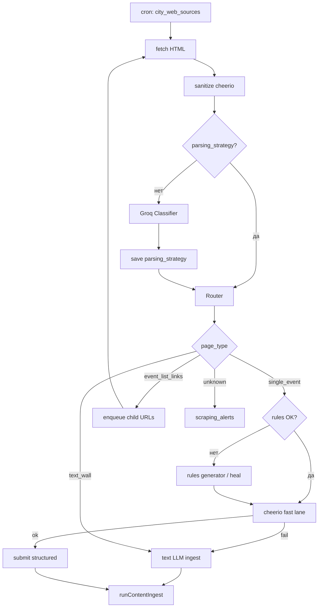

# TASK-008–010 · Web-парсинг: runbook исполнения

**Индекс брейншторма:** [01.06.2026](../../fix/brainstorm/01.06.2026.md)  
**Спеки:** [26-web-scraping-classifier-and-rules.md](../features/content/26-web-scraping-classifier-and-rules.md), [25-groq-event-extraction-prompt.md](../features/content/25-groq-event-extraction-prompt.md), [17-ingest-sources-context.md](../features/content/17-ingest-sources-context.md)

**Текущий код (baseline):** `web-sources-crawl.post.ts` — `fetchUrlPlainText` → один вызов `runContentIngest` на корневой URL. Без classifier, без `parsing_rules`, без очереди дочерних ссылок.

---

## Целевой конвейер

---

## TASK-008 · Схема БД + HTML sanitize

### Миграция `039_web_parsing_strategy.sql` (номер уточнить)

`city_web_sources`:

| Колонка | Тип | Назначение |
|---------|-----|------------|
| `parsing_strategy` | `jsonb` | `{ page_type, list_link_pattern?, confidence?, classified_at }` |
| `parsing_rules` | `jsonb` | Селекторы из [26](../features/content/26-web-scraping-classifier-and-rules.md) |
| `rules_validated_at` | `timestamptz` | Последний успешный fast lane |

`scraping_alerts`:

| Колонка | Тип |
|---------|-----|
| `id` | uuid |
| `web_source_id` | uuid → `city_web_sources` |
| `url` | text |
| `reason` | text (`unknown`, `rules_failed`, `empty_page`, …) |
| `snapshot` | text (≤2k) |
| `resolved_at` | timestamptz null |
| `created_at` | timestamptz |

### Код

| Файл | Задача |
|------|--------|
| `server/utils/webPageSanitizer.ts` | fetch HTML, cheerio: strip script/style/header/footer, extract links[], innerText, truncated markdown (~3k) |
| `server/utils/webPageFetch.ts` | Единая точка fetch (User-Agent, timeout, encoding) — заменить прямой `fetchUrlPlainText` в cron для web |
| `ingestSourcesDashboard.ts` | Типы + map для новых полей |
| `DashboardIngestSourcesPanel.vue` | Показ `page_type`, дата classify, кнопка «сбросить strategy» |

### Критерии

- [ ] Миграция применена на dev
- [ ] `sanitizeWebPage(url)` возвращает `{ text, links, htmlSnippet }` без script/style
- [ ] Dashboard читает/пишет `parsing_strategy` / `parsing_rules` (хотя бы read-only на 008)

---

## TASK-009 · Classifier + Router

### Groq classifier

| Файл | Задача |
|------|--------|
| `server/utils/ai/webPageClassifierSchema.ts` | Zod: `page_type`, `event_urls[]`, `confidence` |
| `server/utils/ai/groqWebPageClassifier.ts` | Модель 8b, промпт на sanitized snippet |
| `server/utils/webCrawlRouter.ts` | `routeWebSource(source, sanitized)` → действия |

### Поведение router

| `page_type` | Действие | Лимиты cron |
|-------------|----------|-------------|
| `single_event` | Передать в fast lane / fallback (010) | 1 URL |
| `event_list_links` | Отфильтровать `event_urls` по `list_link_pattern`, dedupe, fetch до **N=5** за прогон | configurable |
| `text_wall` | `runContentIngest` с полным text + `parse_kind=digest` при необходимости | 1 |
| `unknown` | `insert scraping_alerts`, skip ingest | — |

Сохранять `parsing_strategy` после первого успешного classify. Повторный classify — если `rules_validated_at` старше X дней **или** fast lane failed 2 раза подряд (счётчик в `source_metadata` или колонка).

### Критерии

- [ ] Test crawl на 2 fixture HTML (list + single) в `tests/webPageClassifier.spec.ts`
- [ ] Cron: источник с list-страницей создаёт ≥1 submission с дочернего URL
- [ ] `unknown` не вызывает Groq event parse на мусоре
- [ ] `ai_parse_logs` / summary cron отражает `classified_as`

---

## TASK-010 · parsing_rules + fast lane + healing

### Rules generator

| Файл | Задача |
|------|--------|
| `server/utils/ai/groqParsingRulesSchema.ts` | Zod selectors + `@attr` |
| `server/utils/ai/groqParsingRulesGenerator.ts` | Промпт на sanitized HTML body |
| `server/utils/webParsingRulesApply.ts` | cheerio: `title`, `start_time`, `description`, `price`, `poster` |

### Fast lane → heal → fallback

1. Если `parsing_rules` есть → `applyParsingRules`.
2. Если нет `title` или `start_time` → generator → update rules → retry once.
3. Если снова fail → `scraping_alerts(rules_failed)` + **fallback** `runContentIngest(sanitized.text)` (как сейчас).

Structured submit (если fast lane OK): собрать `rawText` + поля в payload, `sourceKind: web_cron`, `sourceUrl` = event page URL.

### Dashboard

- Список открытых `scraping_alerts` на `content-ai` или ingest panel
- Действие «Resolve» / «Reset rules»

### Критерии

- [ ] Fixture single-event HTML: fast lane без Groq event parse
- [ ] Сломанные rules → auto-heal → новые rules в БД
- [ ] Fallback даёт submission как текущий cron
- [ ] Менеджер видит alert в dashboard

---

## Вне scope (отдельные задачи)

| Тема | Куда |
|------|------|
| `publication_date` в Groq event prompt | Backlog → [25](../features/content/25-groq-event-extraction-prompt.md) |
| VK / `t.me/s/` workers | [27](../features/content/27-ingest-workers-vk-telegram-web.md) |
| Puppeteer / Cloudflare | [17](../features/content/17-ingest-sources-context.md) |
| Hardcoded адаптеры Kassir/Яндекс | После 3+ alerts на один домен |

---

## Порядок коммитов (рекомендация)

1. `039` migration + sanitizer + types  
2. Classifier + router (feature flag `WEB_CLASSIFIER_ENABLED`)  
3. Rules apply + heal + alerts UI  
4. Seed 2–3 реальных URL `cron_enabled` + smoke в runbook
